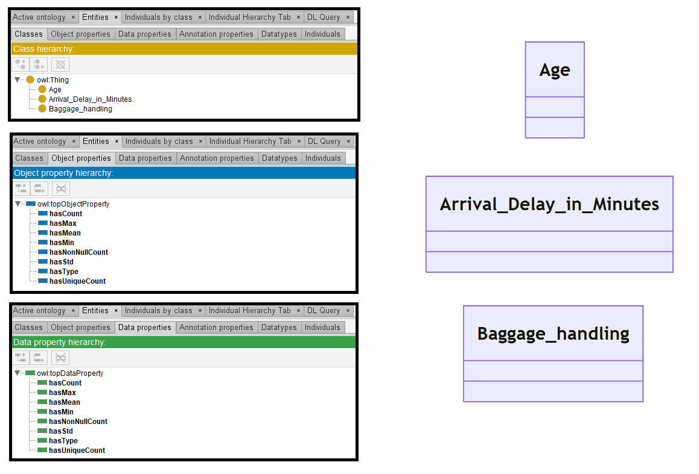

# GPT-3.5

[Generated ontology](./ontology.ttl)
<br>



## [Errors](./ontology_notes.txt)

Ontology without syntax errors, but semantic errors due to DatatypeProperties declarated as ObjectProperties. Example:
```
base:hasCount rdf:type owl:ObjectProperty ;
    rdfs:domain base:Age ;
    rdfs:range xsd:float .
```


## [URIs](./ontology_URIs.xlsx)

| Prefix | URI                                           | Validity | Corrected |
|--------|-----------------------------------------------|----------|-----------|
| rdf    | http://www.w3.org/1999/02/22-rdf-syntax-ns#   | X        | -         |
| rdfs   | http://www.w3.org/2000/01/rdf-schema#         | X        | -         |
| owl    | http://www.w3.org/2002/07/owl#                | X        | -         |
| xsd    | http://www.w3.org/2001/XMLSchema#             | X        | -         |
|        |                                               | **4**    | **0**     |

| URI                  | Validity | Corrected            |
|----------------------|----------|----------------------|
| rdf:type (a)         | X        | -                    |
| rdfs:label           | X        | -                    |
| owl:ObjectProperty   | X        | -                    |
| rdfs:domain          | X        | -                    |
| rdfs:range           | X        | -                    |
| xsd:string           | X        | -                    |
| xsd:float            | X        | -                    |
| *Total*              | **7**    | **0**                |