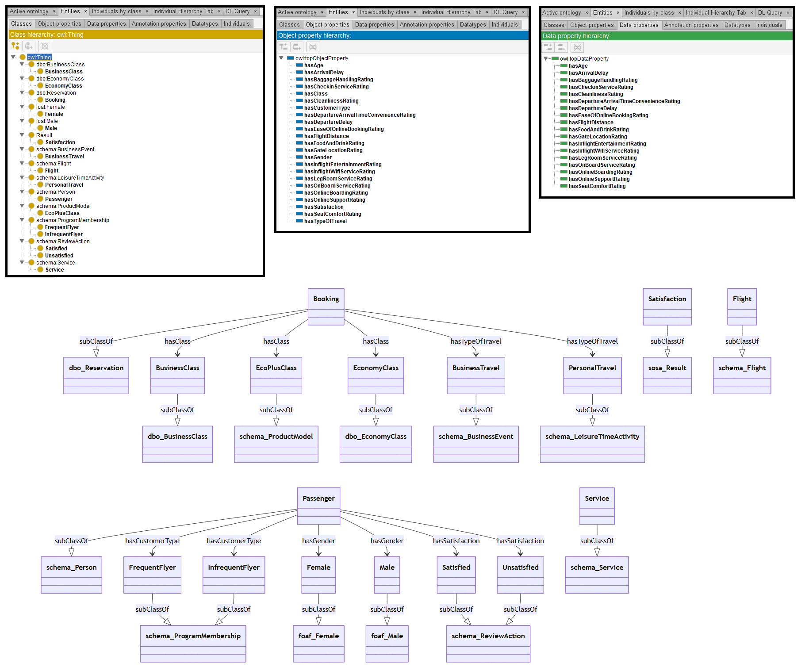

# GPT-4

[Generated ontology](./ontology.owl)
<br>



## [Errors](./ontology_notes.txt)

Ontology without syntax errors, but semantic errors:

-   DatatypeProperties defined as ObjectProperties. Example:
    ```
    base:hasDepartureDelay rdf:type owl:ObjectProperty ;
        rdfs:domain base:Flight ;
        rdfs:range xsd:float .
    ```
-   Wrong URIs. Example: foaf:Male does not exist.


## [URIs](./ontology_URIs.xlsx)

| Prefix | URI                                           | Validity | Corrected |
|--------|-----------------------------------------------|----------|-----------|
| rdf    | http://www.w3.org/1999/02/22-rdf-syntax-ns#   | X        | -         |
| rdfs   | http://www.w3.org/2000/01/rdf-schema#         | X        | -         |
| owl    | http://www.w3.org/2002/07/owl#                | X        | -         |
| xsd    | http://www.w3.org/2001/XMLSchema#             | X        | -         |
| dbo    | http://dbpedia.org/ontology/	                 | X	    | -         |
| schema | http://schema.org/                            | X        | -         |
| foaf   | http://xmlns.com/foaf/0.1/                    | X        | -         |
| sosa   | http://www.w3.org/ns/sosa/                    | X        | -         |
|        |                                               | **8**    | **0**     |

| URI                        | Validity | Corrected                 |
|----------------------------|----------|---------------------------|
| rdf:type (a)               | X        | -                         |
| owl:Class                  | X        | -                         |
| rdfs:subClassOf            | X        | -                         |
| owl:ObjectProperty         | X        | -                         |
| owl:unionOf                | X        | -                         |
| rdfs:domain                | X        | -                         |
| rdfs:range                 | X        | -                         |
| xsd:float                  | X        | -                         |
| xsd:int                    | X        | -                         |
| schema:Person              | X        | -                         |
| schema:Flight              | X        | -                         |
| schema:Service             | X        | -                         |
| schema:ProductModel        | X        | -                         |
| schema:ProgramMembership   | X        | -                         |
| schema:LeisureTimeActivity | -        | base:LeisureTimeActivity  |
| schema:BusinessEvent       | X        | -                         |
| schema:ReviewAction        | X        | -                         |
| dbo:Reservation            | -        | base:Reservation          |
| dbo:BusinessClass          | -        | base:BusinessClass        |
| dbo:EconomyClass           | -        | base:EconomyClass         |
| sosa:Results               | X        | -                         |
| foaf:Male                  | -        | base:Male                 |
| foaf:Female                | -        | base:Female               |
| **Total**                  | **17**   | **6**                     |