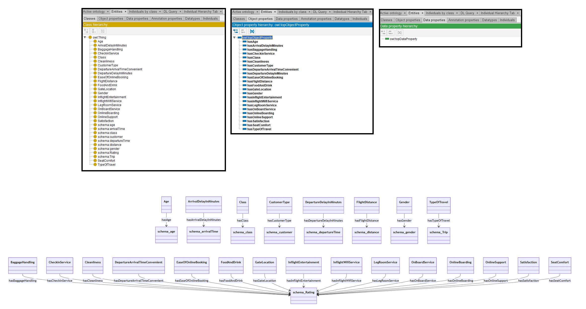

# GPT-4o

[Generated ontology](./ontology.owl)
 

## [Errors](./ontology_notes.txt)

Ontology without syntax errors, but semantics errors. For example, reuse of properties from schema, but as classes.

Also, wrong URIs. Example: schema:age does not exist.

## [URIs](./ontology_URIs.xlsx)

| Prefix  | URI                                           | Validity | Corrected |
|---------|-----------------------------------------------|----------|-----------|
| rdf     | http://www.w3.org/1999/02/22-rdf-syntax-ns#   | X        | -         |
| rdfs    | http://www.w3.org/2000/01/rdf-schema#         | X        | -         |
| owl     | http://www.w3.org/2002/07/owl#                | X        | -         |
| xsd     | http://www.w3.org/2001/XMLSchema#             | X        | -         |
| schema  | http://schema.org/                            | X        | -         |
| foaf    | http://xmlns.com/foaf/0.1/                    | X        | -         |
| dcterms | http://www.w3.org/ns/sosa/                    | X        | -         |
|         |                                               | **7**    | **0**     |

| URI                  | Validity | Corrected    |
|----------------------|----------|--------------|
| rdf:type (a)         | X        | -            |
| owl:Class            | X        | -            |
| owl:ObjectProperty   | X        | -            |
| rdfs:domain          | X        | -            |
| rdfs:range           | X        | -            |
| schema:age           | -        | base:age     |
| schema:arrivalTime   | X        | -            |
| schema:Rating        | X        | -            |
| schema:departureTime | X        | -            |
| schema:distance      | X        | -            |
| schema:class         | -        | base:class   |
| schema:customer      | X        | -            |
| schema:gender        | X        | -            |
| schema:Trip          | X        | -            |
| **Total**            | **12**   | **2**        |

schema:arrivalTime, schema:departureTime, schema:distance, schema:customer, schema:gender are properties, but they are used in the ontology as classes.