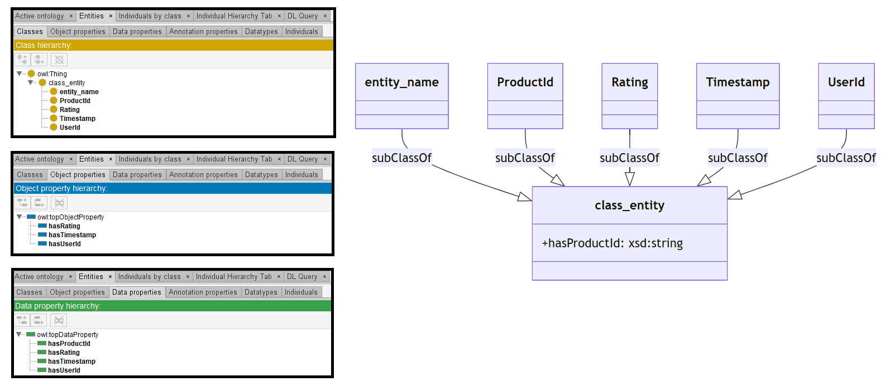

# GPT-3.5

[Generated ontology](./ontology.ttl)
<br>



## [Errors](./ontology_notes.txt)

Ontology without syntax errors, but semantics errors. For example, Datatype properties declarated as Object properties. Example:
```
:hasRating a owl:ObjectProperty ;
    rdfs:domain :class_entity ;
    rdfs:range xsd:integer .
```


## [URIs](./ontology_URIs.xlsx)

| Prefix  | URI                                           | Validity | Corrected |
|---------|-----------------------------------------------|----------|-----------|
| rdfs    | http://www.w3.org/2000/01/rdf-schema#         | X        | -         |
| owl     | http://www.w3.org/2002/07/owl#                | X        | -         |
| xsd     | http://www.w3.org/2001/XMLSchema#             | X        | -         |
|         |                                               | **3**    | **0**     |

| URI                  | Validity | Corrected    |
|----------------------|----------|--------------|
| rdf:type (a)         | X        | -            |
| owl:Class            | X        | -            |
| rdfs:subClassOf      | X        | -            |
| owl:ObjectProperty   | X        | -            |
| rdfs:domain          | X        | -            |
| rdfs:range           | X        | -            |
| xsd:dateTime         | X        | -            |
| xsd:string           | X        | -            |
| xsd:integer          | X        | -            |
| owl:Restriction      | X        | -            |
| owl:onProperty       | X        | -            |
| owl:someValuesFrom   | X        | -            |
| **Total**            | **12**   | **0**        |
