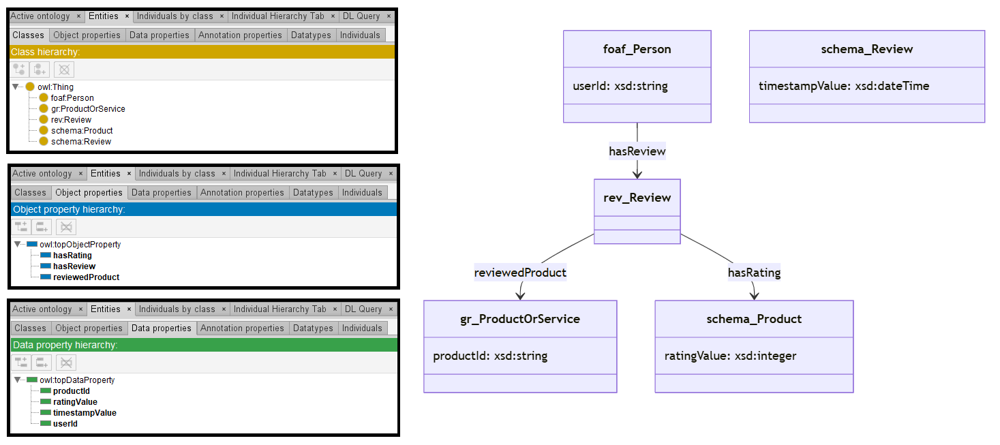

# GPT-4

[Generated ontology](./ontology.owl)
 

## [Errors](./ontology_notes.txt)

Ontology without syntax errors.

## [URIs](./ontology_URIs.xlsx)

| Prefix | URI                                         | Validity | Corrected |
|--------|---------------------------------------------|----------|-----------|
| rdf    | http://www.w3.org/1999/02/22-rdf-syntax-ns# | X        | -         |
| rdfs   | http://www.w3.org/2000/01/rdf-schema#       | X        | -         |
| owl    | http://www.w3.org/2002/07/owl#              | X        | -         |
| xsd    | http://www.w3.org/2001/XMLSchema#           | X        | -         |
| foaf   | http://xmlns.com/foaf/0.1/                  | X        | -         |
| schema | http://schema.org/                          | X        | -         |
| gr     | http://purl.org/goodrelations/v1#           | X        | -         |
| rev    | http://purl.org/stuff/rev#                  | X        | -         |
|        |                                             | **8**    | **0**     |

| URI                  | Validity | Corrected |
|----------------------|----------|-----------|
| rdf:type (a)         | X        | -         |
| owl:Class            | X        | -         |
| owl:ObjectProperty   | X        | -         |
| rdfs:domain          | X        | -         |
| rdfs:range           | X        | -         |
| owl:DatatypeProperty | X        | -         |
| xsd:integer          | X        | -         |
| xsd:string           | X        | -         |
| xsd:dateTime         | X        | -         |
| gr:ProductOrService  | X        | -         |
| foaf:Person          | X        | -         |
| rev:Review           | X        | -         |
| schema:Review        | X        | -         |
| schema:Product       | X        | -         |
| **Total**            | **14**   | **0**     |