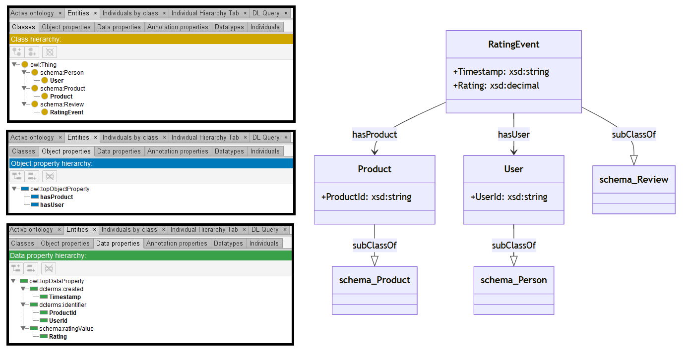

# GPT-4o

[Generated ontology](./ontology.owl)
 

## [Errors](./ontology_notes.txt)

Ontology without syntax errors.

## [URIs](./ontology_URIs.xlsx)

| Prefix  | URI                                         | Validity | Corrected |
|---------|---------------------------------------------|----------|-----------|
| rdf     | http://www.w3.org/1999/02/22-rdf-syntax-ns# | X        | -         |
| rdfs    | http://www.w3.org/2000/01/rdf-schema#       | X        | -         |
| owl     | http://www.w3.org/2002/07/owl#              | X        | -         |
| xsd     | http://www.w3.org/2001/XMLSchema#           | X        | -         |
| dcterms | http://purl.org/dc/terms/                   | X        | -         |
| schema  | http://schema.org/                          | X        | -         |
|         |                                             | **6**    | **0**     |

| URI                  | Validity | Corrected |
|----------------------|----------|-----------|
| rdf:type (a)         | X        | -         |
| owl:Class            | X        | -         |
| rdfs:subClassOf      | X        | -         |
| owl:ObjectProperty   | X        | -         |
| rdfs:domain          | X        | -         |
| rdfs:range           | X        | -         |
| owl:DatatypeProperty | X        | -         |
| xsd:decimal          | X        | -         |
| xsd:string           | X        | -         |
| rdfs:subPropertyOf   | X        | -         |
| schema:Product       | X        | -         |
| schema:Person        | X        | -         |
| schema:Review        | X        | -         |
| schema:ratingValue   | X        | -         |
| dcterms:identifier   | X        | -         |
| dcterms:created      | X        | -         |
| **Total**            | **16**   | **0**     |
