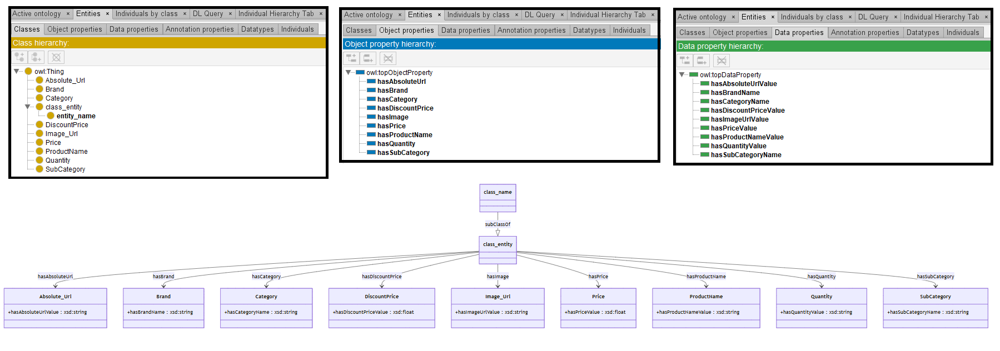

# GPT-3.5

[Generated ontology](./ontology.ttl)
 
[Corrected ontology](./ontology_corrected.ttl)
 

## [Errors](./ontology_notes.txt)

**Incorrect serialization**: 
-   Prefix not defined. Prefix ':' used but not defined.

## [URIs](./ontology_URIs.xlsx)

| Prefix  | URI                                         | Validity | Corrected |
|---------|---------------------------------------------|----------|-----------|
| rdfs    | http://www.w3.org/2000/01/rdf-schema#       | X        | -         |
| owl     | http://www.w3.org/2002/07/owl#              | X        | -         |
| xsd     | http://www.w3.org/2001/XMLSchema#           | X        | -         |
|         |                                             | **3**    | **0**     |

| URI                  | Validity | Corrected |
|----------------------|----------|-----------|
| rdf:type (a)         | X        | -         |
| owl:Class            | X        | -         |
| rdfs:subClassOf      | X        | -         |
| owl:ObjectProperty   | X        | -         |
| rdfs:domain          | X        | -         |
| rdfs:range           | X        | -         |
| owl:DatatypeProperty | X        | -         |
| xsd:float            | X        | -         |
| xsd:string           | X        | -         |
| **Total**            | **9**    | **0**     |
