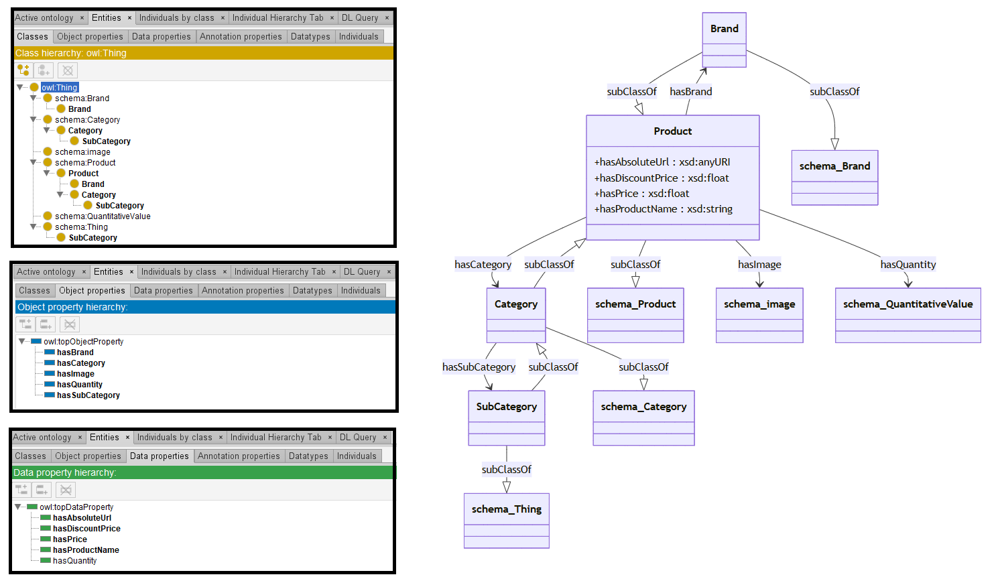

# GPT-4

[Generated ontology](./ontology.ttl)
<br>



## [Errors](./ontology_notes.txt)

Ontology without syntax errors, but semantics error.
-   Object properties declarated as Datatype property:
```
base:hasQuantity rdf:type owl:DatatypeProperty ;
                 rdfs:domain base:Product ;
                 rdfs:range schema:QuantitativeValue .
```

Also **wrong URIs** (schema:Category). 


## [URIs](./ontology_URIs.xlsx)

| Prefix  | URI                                         | Validity | Corrected |
|---------|---------------------------------------------|----------|-----------|
| rdf     | http://www.w3.org/1999/02/22-rdf-syntax-ns# | X        | -         |
| rdfs    | http://www.w3.org/2000/01/rdf-schema#       | X        | -         |
| owl     | http://www.w3.org/2002/07/owl#              | X        | -         |
| xsd     | http://www.w3.org/2001/XMLSchema#           | X        | -         |
| schema  |	http://schema.org/	                        | X	       | -         |
| gr      |	http://purl.org/goodrelations/v1#           | X	       | -         |
| dc      | http://purl.org/dc/elements/1.1/            | X	       | -         |
| foaf	  | http://xmlns.com/foaf/0.1/                  | X	       | -         |
|         |                                             | **8**    | **0**     |


| URI                      | Validity | Corrected    |
|--------------------------|----------|--------------|
| rdf:type (a)             | X        | -            |
| owl:Class                | X        | -            |
| rdfs:subClassOf          | X        | -            |
| owl:ObjectProperty       | X        | -            |
| rdfs:domain              | X        | -            |
| rdfs:range               | X        | -            |
| owl:DatatypeProperty     | X        | -            |
| xsd:anyURI               | X        | -            |
| xsd:string               | X        | -            |
| xsd:float                | X        | -            |
| schema:Product           | X        | -            |
| schema:Brand             | X        | -            |
| schema:Category          | -        | base:Category|
| schema:Thing             | X        | -            |
| schema:QuantitativeValue | X        | -            |
| **Total**                | **14**   | **1**        |
