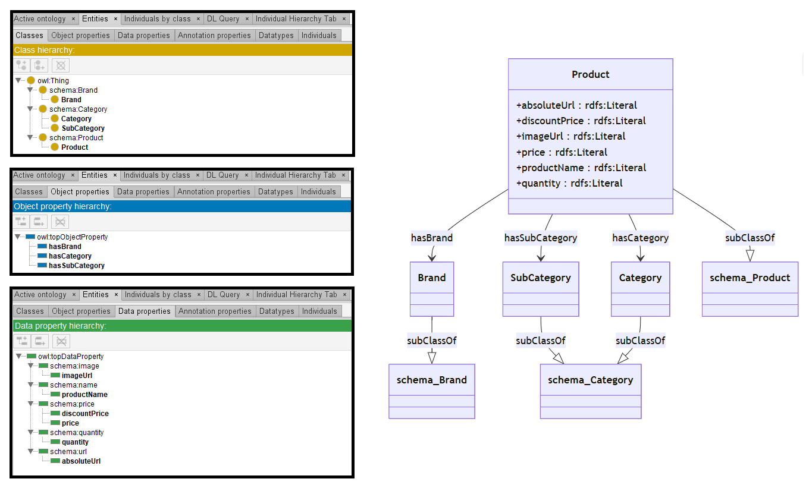

# GPT-4o

[Generated ontology](./ontology.owl)
 

## [Errors](./ontology_notes.txt)

Ontology without syntax errors, but wrong URIs. Example: schema:Category.

## [URIs](./ontology_URIs.xlsx)

| Prefix  | URI                                         | Validity | Corrected |
|---------|---------------------------------------------|----------|-----------|
| rdf     | http://www.w3.org/1999/02/22-rdf-syntax-ns# | X        | -         |
| rdfs    | http://www.w3.org/2000/01/rdf-schema#       | X        | -         |
| owl     | http://www.w3.org/2002/07/owl#              | X        | -         |
| schema  |	http://schema.org/	                        | X	       | -         |
| dcterms | http://purl.org/dc/terms/                   | X	       | -         |
| foaf    | http://xmlns.com/foaf/0.1/                  | X        | -         |
|         |                                             | **6**    | **0**     |

| URI                      | Validity | Corrected     |
|--------------------------|----------|---------------|
| rdf:type (a)             | X        | -             |
| owl:Class                | X        | -             |
| rdfs:subClassOf          | X        | -             |
| owl:ObjectProperty       | X        | -             |
| rdfs:domain              | X        | -             |
| rdfs:range               | X        | -             |
| owl:DatatypeProperty     | X        | -             |
| rdfs:Literal             | X        | -             |
| schema:Product           | X        | -             |
| schema:Brand             | X        | -             |
| schema:Category          | -        | base:Category |
| schema:url               | X        | -             |
| schema:image             | X        | -             |
| schema:name              | X        | -             |
| schema:quantity          | -        | base:quantity |
| schema:price             | X        | -             |
| **Total**                | **14**   | **2**         |
