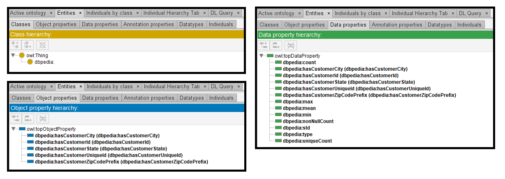
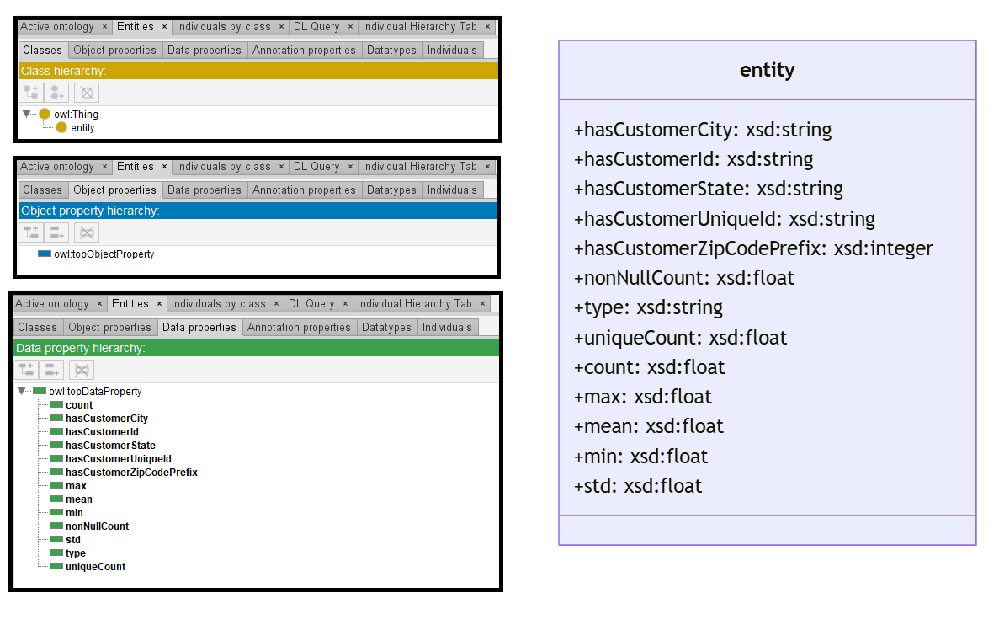

# GPT-3.5

[Generated ontology](./ontology.ttl)
<br>

<br>
[Corrected ontology](./ontology_corrected.ttl)
<br>



## [Errors](./ontology_notes.txt)

Ontology without syntax errors, but semantic errors. For example, Datatype properties declarated as Object properties:
```
entity_customer:hasCustomerCity a owl:ObjectProperty ;
    rdfs:domain entity_customer: ;
    rdfs:range xsd:string .
```

Also **wrong URIs**. Example: entity_customer:hasCustomerCity.


## [URIs](./ontology_URIs.xlsx)

| Prefix  | URI                                         | Validity | Corrected |
|---------|---------------------------------------------|----------|-----------|
| rdf     | http://www.w3.org/1999/02/22-rdf-syntax-ns# | X        | -         |
| rdfs    | http://www.w3.org/2000/01/rdf-schema#       | X        | -         |
| owl     | http://www.w3.org/2002/07/owl#              | X        | -         |
| xsd     | http://www.w3.org/2001/XMLSchema#           | X        | -         |
| entity_customer | http://dbpedia.org/resource/        | X        | -         |
|         |                                             | **5**    | **0**     |


| URI                                 | Validity | Corrected            |
|-------------------------------------|----------|----------------------|
| rdf:type (a)                        | X        | -                    |
| owl:Class                           | X        | -                    |
| owl:ObjectProperty                  | X        | -                    |
| rdfs:domain                         | X        | -                    |
| rdfs:range                          | X        | -                    |
| owl:DatatypeProperty                | X        | -                    |
| xsd:string                          | X        | -                    |
| xsd:integer                         | X        | -                    |
| xsd:float                           | X        | -                    |
| entity_customer:hasCustomerCity     | -        | :hasCustomerCity     |
| entity_customer:hasCustomerId       | -        | :hasCustomerId       |
| entity_customer:hasCustomerState    | -        | :hasCustomerState    |
| entity_customer:hasCustomerUniqueId | -        | :hasCustomerUniqueId |
| entity_customer:nonNullCount        | -        | :nonNullCount        |
| entity_customer:uniqueCount         | -        | :uniqueCount         |
| entity_customer:type                | -        | :type                |
| entity_customer:count               | -        | :count               |
| entity_customer:max                 | -        | :max                 |
| entity_customer:mean                | -        | :mean                |
| entity_customer:min                 | -        | :min                 |
| entity_customer:std                 | -        | :std                 |
| **Total**                           | **9**    | **12**               |

