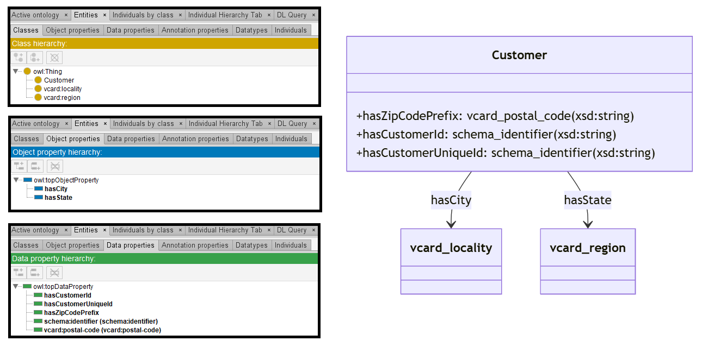

# GPT-4

[Generated ontology](./ontology.owl)
<br>



## [Errors](./ontology_notes.txt)

Ontology without syntax errors, but semantic errors. For example, Datatype properties declarated as Object properties:
```
base:hasZipCodePrefix a owl:DatatypeProperty ;
    rdfs:domain base:Customer ;
    rdfs:range vcard:postal-code .
```


## [URIs](./ontology_URIs.xlsx)

| Prefix  | URI                                         | Validity | Corrected |
|---------|---------------------------------------------|----------|-----------|
| rdf     | http://www.w3.org/1999/02/22-rdf-syntax-ns# | X        | -         |
| rdfs    | http://www.w3.org/2000/01/rdf-schema#       | X        | -         |
| owl     | http://www.w3.org/2002/07/owl#              | X        | -         |
| xsd     | http://www.w3.org/2001/XMLSchema#           | X        | -         |
| vcard   | http://www.w3.org/2006/vcard/ns#            | X        | -         |
| schema  | http://schema.org/                          | X        | -         |
|         |                                             | **6**    | **0**     |


| URI                  | Validity | Corrected            |
|----------------------|----------|----------------------|
| rdf:type (a)         | X        | -                    |
| owl:Class            | X        | -                    |
| owl:ObjectProperty   | X        | -                    |
| rdfs:domain          | X        | -                    |
| rdfs:range           | X        | -                    |
| owl:DatatypeProperty | X        | -                    |
| xsd:string           | X        | -                    |
| vcard:locality       | X        | -                    |
| vcard:region         | X        | -                    |
| vcard:postal-code    | X        | -                    |
| schema:identifier    | X        | -                    |
| **Total**            | **11**   | **0**                |

