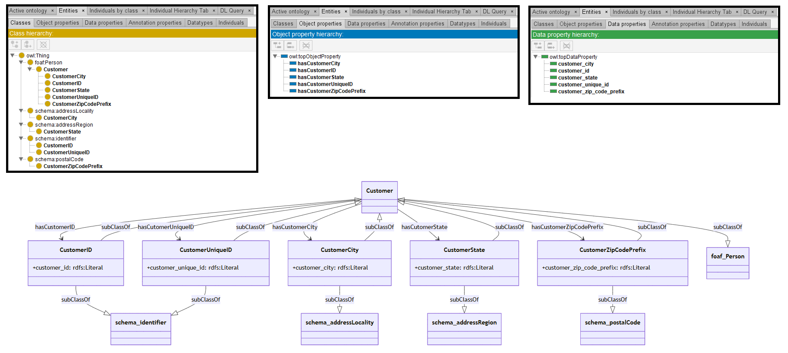

# GPT-4o

[Generated ontology](./ontology.ttl)
 

## [Errors](./ontology_notes.txt)

Ontology without syntax errors.

## [URIs](./ontology_URIs.xlsx)

| Prefix  | URI                                         | Validity | Corrected |
|---------|---------------------------------------------|----------|-----------|
| rdf     | http://www.w3.org/1999/02/22-rdf-syntax-ns# | X        | -         |
| rdfs    | http://www.w3.org/2000/01/rdf-schema#       | X        | -         |
| owl     | http://www.w3.org/2002/07/owl#              | X        | -         |
| foaf    | http://xmlns.com/foaf/0.1/                  | X        | -         |
| schema  | http://schema.org/                          | X        | -         |
|         |                                             | **5**    | **0**     |

| URI                     | Validity | Corrected |
|--------------------------|----------|-----------|
| rdf:type (a)             | X        | -         |
| owl:Class                | X        | -         |
| rdfs:subClassOf          | X        | -         |
| owl:ObjectProperty       | X        | -         |
| rdfs:domain              | X        | -         |
| rdfs:range               | X        | -         |
| owl:DatatypeProperty     | X        | -         |
| rdfs:Literal             | X        | -         |
| foaf:Person              | X        | -         |
| schema:identifier        | X        | -         |
| schema:addressLocality   | X        | -         |
| schema:addressRegion     | X        | -         |
| schema:postalCode        | X        | -         |
| **Total**                | **13**   | **0**     |
