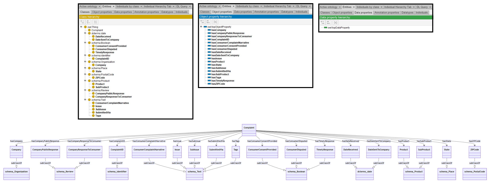

# GPT-4o

[Generated ontology](./ontology.owl)
<br>



## [Errors](./ontology_notes.txt)

Ontology without syntax errors, but semantics errors. For example, schema:identifier is a property, but class entity is declarated as subClassOf this property:
```
base:ComplaintID a owl:Class ;
    rdfs:subClassOf schema:identifier .
```

Also wrong URIs, like schema:PostalCode, that does not exist.


## [URIs](./ontology_URIs.xlsx)

| Prefix  | URI                                         | Validity | Corrected |
|---------|---------------------------------------------|----------|-----------|
| rdf     | http://www.w3.org/1999/02/22-rdf-syntax-ns# | X        | -         |
| rdfs    | http://www.w3.org/2000/01/rdf-schema#       | X        | -         |
| owl     | http://www.w3.org/2002/07/owl#              | X        | -         |
| xsd     |	http://www.w3.org/2001/XMLSchema#           | X        | -         |
| dcterms |	http://purl.org/dc/terms/                   | X        | -         |
| schema  |	http://schema.org/                          | X        | -         |
|         |                                             | **6**    | **0**     |


| URI                      | Validity | Corrected       |
|--------------------------|----------|-----------------|
| rdf:type (a)             | X        | -               |
| owl:Class                | X        | -               |
| rdfs:subClassOf          | X        | -               |
| owl:ObjectProperty       | X        | -               |
| rdfs:domain              | X        | -               |
| rdfs:range               | X        | -               |
| schema:Organization      | X        | -               |
| schema:Review            | X        | -               |
| schema:Product           | X        | -               |
| schema:Text              | X        | -               |
| schema:Boolean           | X        | -               |
| dcterms:date             | X        | -               |
| schema:Product           | X        | -               |
| schema:Place             | X        | -               |
| schema:identifier        | X        | -               |
| schema:PostalCode        | -        | base:PostalCode |
| **Total**                | **14**   | **1**           |
