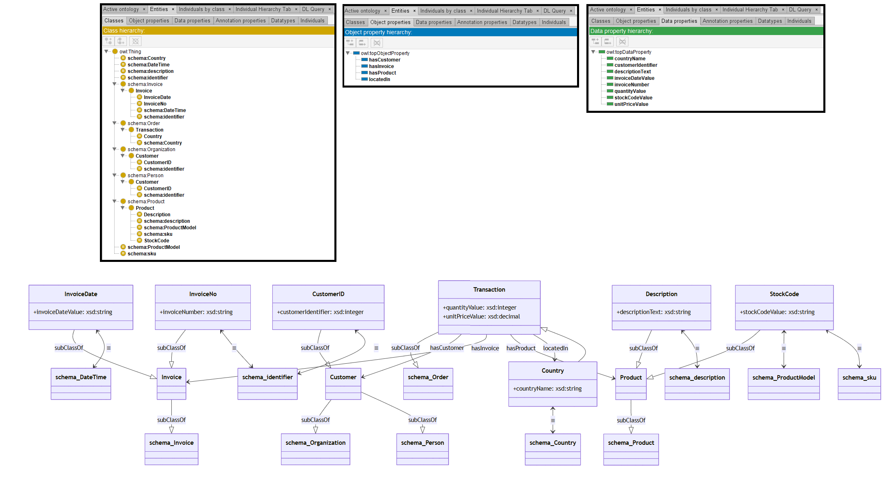

# GPT-4

[Generated ontology](./ontology.ttl)
<br>



## [Errors](./ontology_notes.txt)

Ontology without syntax errors, but semantic errors because entity classes are defined as equivalents of properties. Example:
```
base:CustomerID a owl:Class ;
    rdfs:subClassOf base:Customer ;
    owl:equivalentClass schema:identifier .
``` 


## [URIs](./ontology_URIs.xlsx)

| Prefix  | URI                                         | Validity | Corrected |
|---------|---------------------------------------------|----------|-----------|
| rdf     | http://www.w3.org/1999/02/22-rdf-syntax-ns# | X        | -         |
| rdfs    | http://www.w3.org/2000/01/rdf-schema#       | X        | -         |
| owl     | http://www.w3.org/2002/07/owl#              | X        | -         |
| xsd     |	http://www.w3.org/2001/XMLSchema#           | X        | -         |
| dc      |	http://purl.org/dc/elements/1.1/            | X	       | -         |
| foaf    |	http://xmlns.com/foaf/0.1/                  | X        | -         |
| schema  |	http://schema.org/                          | X        | -         |
| skos    |	http://www.w3.org/2004/02/skos/core#        | X        | -         |
| gr      |	http://purl.org/goodrelations/v1#           | X        | -         |
|         |                                             | **9**    | **0**     |


| URI                      | Validity | Corrected |
|--------------------------|----------|-----------|
| rdf:type (a)             | X        | -         |
| owl:Class                | X        | -         |
| rdfs:subClassOf          | X        | -         |
| owl:ObjectProperty       | X        | -         |
| owl:equivalentClass      | X        | -         |
| rdfs:domain              | X        | -         |
| rdfs:range               | X        | -         |
| xsd:integer              | X        | -         |
| xsd:decimal              | X        | -         |
| xsd:string               | X        | -         |
| schema:Order             | X        | -         |		
| schema:Product		   | X        | -         |
| schema:Person		       | X        | -         |
| schema:Organization	   | X        | -         |
| schema:Invoice		   | X        | -         |
| schema:DateTime		   | X        | -         |
| schema:identifier		   | X        | -         |
| schema:ProductModel	   | X        | -         |
| schema:sku			   | X        | -         |
| schema:description	   | X        | -         |
| schema:Country		   | X        | -         |
| **Total**                | **21**   | **0**     |
