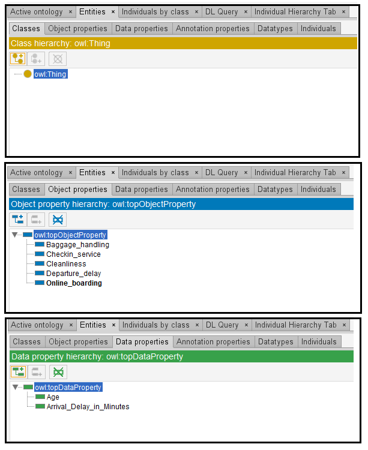
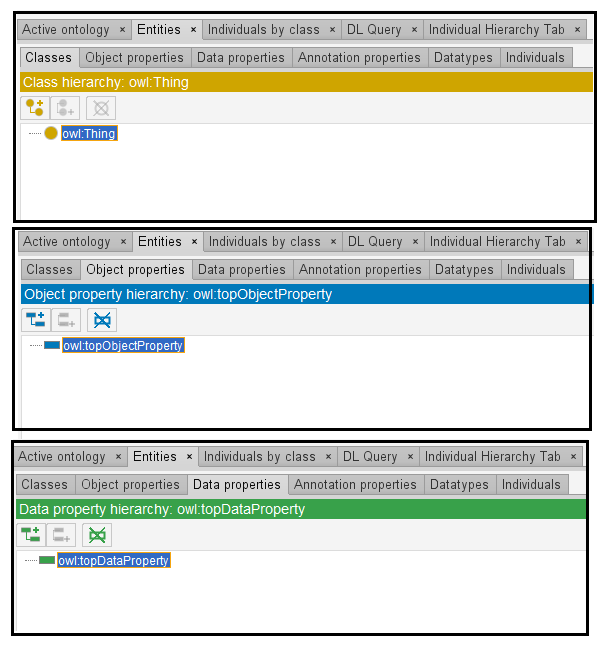

# Llama-2-13B

## Llama-2-13B-4bits

[Generated ontology](./4bits_ontology.txt)
[Corrected ontology](./4bits_ontology_corrected.txt)

### Errors

Incorrect serialization: 
-   Incorrect format and number of elements in the triples. Example:
    <http://example.com/ontology/Passenger/Age> a owl:type rdf:HTTP_timestamp">

-   And loop in the last triple:
    <http://Cleaning> a passenger> a passenger> a passenger> a passenger> a passenger> a passenger> a passenger> a passenger> a passenger> a passenger> a passenger> a passenger> a passenger> a passenger> a passenger> a passenger> a passenger> a passenger> a passenger> a passenger> a passenger> a passenger> a passenger> a passenger> a passenger> a passenger> a passenger> a passenger> a passenger> a passenger> a passenger> a passenger> a passenger> a passenger> a passenger> a passenger> a passenger> a passenger> a passenger> a passenger> a passenger> a passenger> a passenger> a passenger> a passenger> a passenger>a>a>a>a>a>a>a>a>a>a>a>a>a>a>a>a>a>a>a>a>a>a>a>a>a>a>a>a>a>a>a>a>a>a>a>a>a>a>a>a>a>a>a>a>a>a>a>a>a>a>a>a>a>a>a>a>a>a>a>a>a>a>a>a>a>a>a>a>a>a>a>a>a>a>a>a>a>a>a>a>a>a>a>a>a>a>a>a/pass/passing theprior/passing the_passing/passing_passing_passing",p"pt",p

-   Incorrect URIs. Some URIs do not exist, like rdf:HTTP_timestamp

### URIs

| Prefix | URI                                           | Validity | Corrected |
|--------|-----------------------------------------------|----------|-----------|
| rdf    | http://www.w3.org/1999/02/22-rdf-syntax-ns#   | X        | -         |
| owl    | http://www.w3.org/2002/07/owl#                | X        | -         |
| xsd    | http://www.w3.org/2001/XMLSchema#             | X        | -         |
|        |                                               | **3**    | **0**     |

| URI                 | Validity | Corrected      |
|---------------------|----------|----------------|
| owl:Ontology        | X        | -              |
| owl:version         | X        | -              |
| a (rdf:type)        | X        | -              |
| rdf:Property        | X        | -              |
| owl:ObjectProperty  | X        | -              |
| owl:DatatypeProperty| X        | -              |
| owl:domain          | -        | rdfs:domain    |
| owl:range           | -        | rdfs:range     |
| rdf:HTTP_timestamp  | -        | :HTTP_timestamp|
| xsd:integer         | X        | -              |
| *Total*             | **7**    | **3**          |

## Llama-2-13B-8bits

[Generated ontology](./8bits_ontology.txt)
[Corrected ontology](./8bits_ontology_corrected.txt)

### Errors

Incorrect format and serialization:
-   Loop at the end of the ontology:
    <http/Flight/Flight/Flight/Flight/Flight/Flight/Flight/Flight/Flight/Flight/Flight/Flight/Flight/Flight/Flight/Flight/Flight/Flight/Flight/Flight/Flight/Flight/Flight/Flight/Flight/Flight/Flight/Flight/Flight/Flight/Flight/Flight/Flight/Flight/Flight/Flight/Flight/Flight

-   Incorrect serialization due to the number of elements in the triples. Example:
    <http://example.com/ontology/Passenger> owl:class <http://example.com/ontology/Age> "120"^^xsd:integer" .
    <http://example.com/Flight> "10"^^xsd:integer" .

-   Incorrect URIs. Used of owl:class instead of owl:Class, and used as property.

-   Uncommented text: 
    Here is the TURTLE syntax for the proposed ontology

### URIs

| Prefix | URI                                           | Validity | Corrected |
|--------|-----------------------------------------------|----------|-----------|
| rdf    | http://www.w3.org/1999/02/22-rdf-syntax-ns#   | X        | -         |
| owl    | http://www.w3.org/2002/07/owl#                | X        | -         |
| xsd    | http://www.w3.org/2001/XMLSchema#             | X        | -         |
|        |                                               | **3**    | **0**     |

| URI           | Validity | Corrected   |
|---------------|----------|-------------|
| owl:Ontology  | X        | -           |
| rdf:type (a)  | X        | -           |
| owl:imports   | X        | -           |
| owl:class     | -        | owl:Class   |
| owl:hasValue  | X        | -           |
| xsd:integer   | X        | -           |
| *Total*       | **5**    | **1**       |

owl:class used as property
owl:hasValue used in an inappropriate way

## Llama-2-13B

[Generated ontology](./all_ontology.txt)

### Errors

Incorrect format, that is, the file do not follow a Turtle structure to serialize RDF triples.