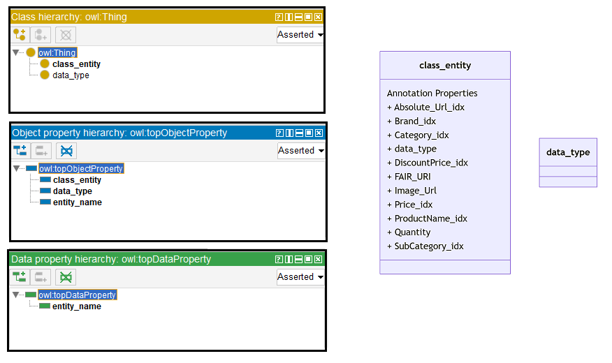
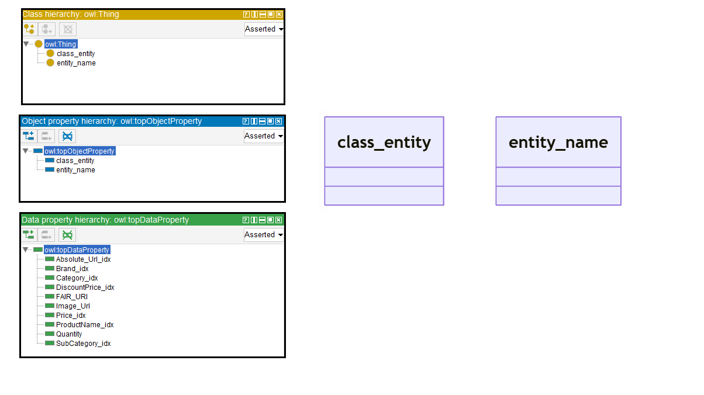

# Llama-2-13B

## Llama-2-13B-4bits

[Generated ontology](./4bits_ontology.txt)
<br>
[Corrected ontology](./4bits_ontology_corrected.txt)
<br>


### [Errors](./ontology_4bits_notes.txt)

-   **Incorrect serialization** (number of elements in the triples). Example:
    ```
    <http://base_ontology.com/class_entity> owl:hasValue <http://base_ontology.com/Absolute_Url_idx> "count" ;
    ```

-   **Wrong URIs** and inappropriate reuse. Examples: owl:domain and owl:ranges, and the use of owl:inverseOf.


### [URIs](./ontology_4bits_URIs.xlsx)

| Prefix | URI                                           | Validity | Corrected |
|--------|-----------------------------------------------|----------|-----------|
| rdf    | http://www.w3.org/1999/02/22-rdf-syntax-ns#   | X        | -         |
| owl    | http://www.w3.org/2002/07/owl#                | X        | -         |
| xsd    | http://www.w3.org/2001/XMLSchema#             | X        | -         |
|        |                                               | **3**    | **0**     |

| URI                | Validity | Corrected   |
|--------------------|----------|-------------|
| owl:Class          | X        | -           |
| owl:inverseOf      | X        | -           |
| owl:ObjectProperty | X        | -           |
| owl:domain         | -        | rdfs:domain |
| owl:range          | -        | rdfs:range  |
| rdf:type (a)       | X        | -           |
| xsd:string         | X        | -           |
| *Total*            | **5**    | **2**       |

-   owl:inverseOf used in an inappropriate way.


## Llama-2-13B-8bits

[Generated ontology](./8bits_ontology.txt)
<br>
[Corrected ontology](./8bits_ontology_corrected.txt)
<br>


### [Errors](./ontology_8bits_notes.txt)

-   **Uncommented text:** <br>
    Here is the TURTLE syntax content for the proposed ontology, without any abbreviations or shortening, and with strict compliance to the instructions provided

-   **Wrong URIs.** Example:
    ```
    <data_property_name> owl:domain <class_entity> .
    ```


### [URIs](./ontology_8bits_URIs.xlsx)

| Prefix | URI                                           | Validity | Corrected |
|--------|-----------------------------------------------|----------|-----------|
| rdf    | http://www.w3.org/1999/02/22-rdf-syntax-ns#   | X        | -         |
| rdfs   | http://www.w3.org/2000/01/rdf-schema#         | X        | -         |
| owl    | http://www.w3.org/2002/07/owl#                | X        | -         |
| xsd    | http://www.w3.org/2001/XMLSchema#             | X        | -         |
|        |                                               | **4**    | **0**     |

| URI                | Validity | Corrected            |
|--------------------|----------|----------------------|
| owl:Ontology       | X        | -                    |
| owl:imports        | X        | -                    |
| owl:class          | -        | owl:Class            |
| owl:subClassOf     | -        | rdfs:subClassOf      |
| owl:hasSelf        | X        | -                    |
| owl:property       | -        | rdf:Property         |
| rdf:type (a)       | X        | -                    |
| owl:domain         | -        | rdfs:domain          |
| owl:range          | -        | rdfs:range           |
| owl:dataRange      | -        | owl:DataRange        |
| owl:URI            | -        | :URI                 |
| owl:value          | -        | rdf:value            |
| owl:Text           | -        | :Text                |
| owl:ObjectProperty | X        | -                    |
| owl:DataProperty   | -        | owl:DatatypeProperty |
| *Total*            | **5**    | **10**               |

-   owl:class (owl:Class) used as node and property, but it is a node (rdf:Class).
-   owl:hasSelf used incorrectly (owl:Restriction as domain).
-   owl:property (rdf:Poperty) used as property, but it is a node (rdf:Class).
-   owl:dataRange (owl:DataRange) used as property, but it is a node (rdf:Class)
-   owl:URI (xsd:anyURI) and owl:Text (xsd:string) used as node, but there are a datatype.
-   owl:dataRange (owl:DataRange) has been deprecated as of OWL2.


## Llama-2-13B without quantization

[Generated ontology](./all_ontology.txt)
<br>
[Corrected ontology](./all_ontology_corrected.txt)
<br>



### [Errors](./ontology_all_notes.txt)

-   **Incorrect serialization:** Lack of shortnames, serialization dots, and incorrect number of elements in the triples. Example:
    ```
    class class_entity (rdf:type owl:Class)
       owl:hasSelf rdf:type owl:Class
       owl:hasKey rdf:type owl:ObjectProperty
    ```

-   **Uncommented text.** Examples: <br>
    Sure, here is the TURTLE syntax content for the proposed ontology based on the provided JSON data and schema:

-   **Wrong URIs.** Example: owl:NumericDatatype


### [URIs](./ontology_all_URIs.xlsx)

| Prefix | URI                                           | Validity | Corrected |
|--------|-----------------------------------------------|----------|-----------|
| rdf    | http://www.w3.org/1999/02/22-rdf-syntax-ns#   | X        | -         |
| rdfs   | http://www.w3.org/2000/01/rdf-schema#         | X        | -         |
| owl    | http://www.w3.org/2002/07/owl#                | X        | -         |
| xsd    | http://www.w3.org/2001/XMLSchema#             | X        | -         |
|        |                                               | **4**    | **0**     |

| URI                  | Validity | Corrected   |
|----------------------|----------|-------------|
| owl:Ontology         | X        | -           |
| rdf:type (a)         | X        | -           |
| owl:Class            | X        | -           |
| owl:ObjectProperty   | X        | -           |
| owl:DatatypeProperty | X        | -           |
| owl:hasSelf          | X        | -           |
| owl:hasKey           | X        | -           |
| owl:hasDomain        | -        | rdfs:domain |
| owl:hasRange         | -        | rdfs:range  |
| owl:NumericDatatype  | -        | xsd:numeric |
| owl:StringDatatype   | -        | xsd:string  |
| *Total*              | **7**    | **4**       |

-   owl:hasSelf and owl:hasKey are used incorrectly.
-   There are classes and ObjectProperty that share the same URIs.