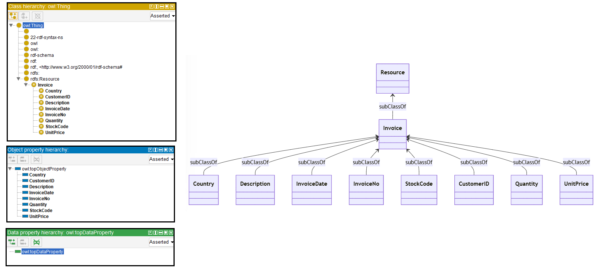
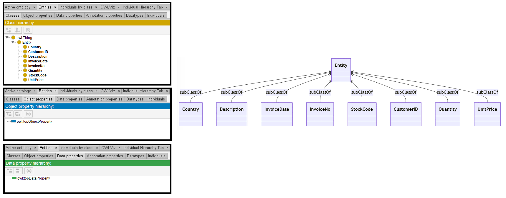
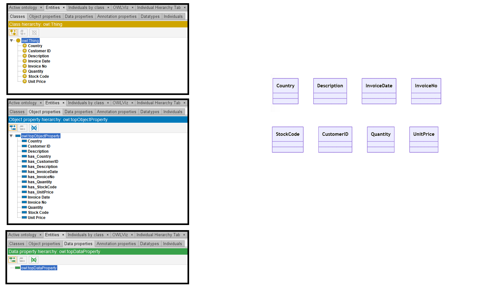

# Llama-2-13B

## Llama-2-13B-4bits

[Generated ontology](./4bits_ontology.txt)
<br>
[Corrected ontology](./4bits_ontology_corrected.txt)
<br>



### Errors

-   Incorrect format and serialization (number of elements in the triples, dots, and incorrect representation of URIs with quotes). Example: <br>
    ```
    class class_entity {
        owl:ontology owl:version "1.0" .
        rdfs:subClassOf rdf:Resource .
        rdfs:label "Invoice" ;
        owl:oneOf ( "Country" "Description" "InvoiceDate" "InvoiceNo" "StockCode" "CustomerID" "Quantity" "UnitPrice" ) .
        rdfs:comment "An invoice is a document issued by a seller to a buyer for the sale and delivery of goods or services." .
        rdfs:domain "http://base_ontology.com/" .
        rdfs:range "http://www.w3.org/1999/02/22-rdf-syntax-ns#, http://www.w3.org/2000/01/rdf-schema#, http://www.w3.org/2002/07/owl#" .
        owl:inverseOf "CustomerID" "Quantity" .
        owl:inverseOf "InvoiceDate" "InvoiceNo" .
        owl:inverseOf "StockCode" "Quantity" .
    }
    ```

-   Wrong URIs. Example: rdf:Resource instead of rdfs:Resource


### URIs

| Prefix | URI                                         | Validity | Corrected |
|--------|---------------------------------------------|----------|-----------|
| rdf    | http://www.w3.org/1999/02/22-rdf-syntax-ns# | X        | -         |
| owl    | http://www.w3.org/2002/07/owl#              | X        | -         |
| rdfs   | https://www.w3.org/2000/01/rdf-schema#      | X        | -         |
|        |                                             | **3**    | **0**     |

| URI               | Validity | Corrected        |
|-------------------|----------|------------------|
| owl:ontology      | -        | owl:Ontology     |
| rdfs:subClassOf   | X        | -                |
| rdf:Resource      | -        | rdfs:Resource    |
| rdfs:label        | X        | -                |
| rdfs:comment      | X        | -                |
| rdfs:domain       | X        | -                |
| rdfs:range        | X        | -                |
| owl:inverseOf     | X        | -                |
| *Total*           | 6        | 3                |

-   owl:inverseOf used incorrectly.


## Llama-2-13B-8bits

[Generated ontology](./8bits_ontology.txt) 
<br>
[Corrected ontology](./8bits_ontology_corrected.txt)
<br>



### Errors

-   Incorrect serialization (number of elements in the triples, shortnames and dots), and uncommented text:
    <br>
    Here is the proposed ontology for the given JSON data in TURTLE syntax:
    ```
    class Country (owl:Class)
        rdf:type owl:Class.
        rdfs:subClassOf owl:Entity.
        owl:hasSelf rdf:type owl:Class.
    ```

-   Wrong URIs. Example: owl:Entity


### URIs

| Prefix | URI                                         | Validity | Corrected |
|--------|---------------------------------------------|----------|-----------|
| rdf    | http://www.w3.org/1999/02/22-rdf-syntax-ns# | X        | -         |
| owl    | http://www.w3.org/2002/07/owl#              | X        | -         |
| rdfs   | https://www.w3.org/2000/01/rdf-schema#      | X        | -         |
|        |                                             | **3**    | **0**     |

| URI                | Validity | Corrected |
|--------------------|----------|-----------|
| owl:Class          | X        | -         |
| owl:Entity         | -        | :Entity   |
| rdf:type (a)       | X        | -         |
| rdfs:subClassOf    | X        | -         |
| owl:hasSelf        | X        | -         |     
| *Total*            | **4**    | **1**     |

-   owl:hasSelf used incorrectly.


## Llama-2-13B without quantization

[Generated ontology](./all_ontology.txt)
<br>
[Corrected ontology](./all_ontology_corrected.txt)
<br>



### Errors

-   Incorrect serialization (number of elements in the triples, and dots), and uncommented text. Example:
    <br>
    Sure, here is the TURTLE syntax for the proposed ontology based on the provided JSON data and instructions:
    ```
    class Country (owl:Class)
        rdf:type owl:Class.
        rdfs:label "Country";
        owl:oneOf (
            base_ontology:Country_1,
            base_ontology:Country_2,
            base_ontology:Country_3
        );
        owl:hasValue (
            base_ontology:Country_1 "Australia",
            base_ontology:Country_2 "Austria",
            base_ontology:Country_3 "Belgium"
        );
        owl:inverseOf base_ontology:has_Country.
    ```
   
-   URIs used incorrectly. Example: owl:hasValue to link two classes (rdfs:domain owl:Restriction).


### URIs

| Prefix | URI                                         | Validity | Corrected |
|--------|---------------------------------------------|----------|-----------|
| rdf    | http://www.w3.org/1999/02/22-rdf-syntax-ns# | X        | -         |
| owl    | http://www.w3.org/2002/07/owl#              | X        | -         |
| rdfs   | https://www.w3.org/2000/01/rdf-schema#      | X        | -         |
|        |                                             | **3**    | **0**     |

| URI           | Validity | Corrected |
|---------------|---------|------------|
| rdf:type      | X       | -          |
| rdfs:label    | X       | -          |
| owl:Class     | X       | -          |
| owl:oneOf     | X       | -          |
| owl:hasValue  | X       | -          |
| owl:inverseOf | X       | -          |
| *Total*       | **6**   | **0**      |

- owl:hasValue and owl:inverseOf used incorrectly.