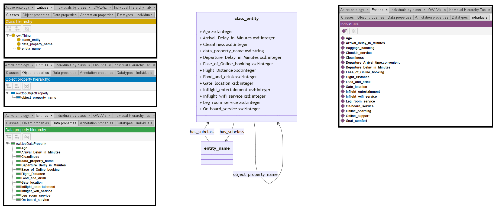

# Llama-2-70B

## Llama-2-70B-4bits

[Generated ontology](./4bits_ontology.txt)
<br>
[Corrected ontology](./4bits_ontology_corrected.txt)
<br>



### [Errors](./4bits_ontology_notes.txt)

**Incorrect serialization:**
-   Incorrect shortnames, like class_entity:
    ```
    class_entity
        a owl:Class;
        owl:has_subclass entity_name .
    ```

-   Incorrect numeric values. Example:
    ```
    Baggage handling
        a entity_name;
        owl:has_value 1..5 .
    ```
-   Incorrect IDs. Example: Checkin service

-   Incomplete ontology due to an entity modelling in a loop:
    ```
    Age
        owl:domain owl:domain xsd:integer ;
        owl:
        a
        owl:domain xsd:integer xsd:integer
        owl:domain xsd:integer
        owl:integer
        owl:integer
        owl:integer
        owl:integer
    ```

**Incorrect URIs.** Example: owl:domain instead of rdfs:domain.


### [URIs](./ontology_4bits_URIs.xlsx)

| Prefix | URI                                           | Validity | Corrected |
|--------|-----------------------------------------------|----------|-----------|
| rdf    | http://www.w3.org/1999/02/22-rdf-syntax-ns#   | X        | -         |
| rdfs   | http://www.w3.org/2000/01/rdf-schema#         | X        | -         |
| owl    | http://www.w3.org/2002/07/owl#                | X        | -         |
| xsd    | http://www.w3.org/2001/XMLSchema#             | X        | -         |
|        |                                               | **4**    | **0**     |


| URI                 | Validity | Corrected            |
|---------------------|----------|----------------------|
| owl:Class           | X        | -                    |
| owl:has_subclass    | -        | :has_subclass        |
| owl:ObjectProperty  | X        | -                    |
| owl:DataProperty    | -        | owl:DatatypeProperty |
| owl:domain          | -        | rdfs:domain          |
| owl:range           | -        | rdfs:range           |
| rdf:type (a)        | X        | -                    |
| owl:has_value       | -        | :has_value           |
| xsd:integer         | X        | -                    |
| xsd:string          | X        | -                    |
| *Total*             | **3**    | **5**                |