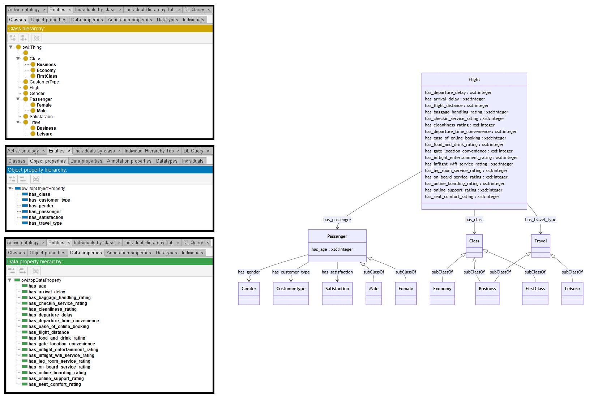

# Llama-3-70B

## Llama-3-70B-4bits

[Generated ontology](./ontology.txt)
<br>
[Corrected ontology](./ontology_corrected.txt)
<br>


### [Errors](./ontology_notes.txt)

**Incorrect serialization:**
-   Incorrect statement of the ontology:
    ```
    owl:Ontology( <https://base_ontology.com#> )
    ```

-   Lack of end dots and @ in the prefix definition:
    ```
    prefix owl: <http://www.w3.org/2002/07/owl#>
    prefix rdf: <http://www.w3.org/1999/02/22-rdf-syntax-ns#>
    prefix rdfs: <http://www.w3.org/2000/01/rdf-schema#>
    prefix xsd: <http://www.w3.org/2001/XMLSchema#>
    prefix base: <https://base_ontology.com#>
    ```

**Uncommented text:** Here is the TURTLE ontology:


### [URIs](./ontology_URIs.xlsx)

| Prefix | URI                                           | Validity | Corrected |
|--------|-----------------------------------------------|----------|-----------|
| rdf    | http://www.w3.org/1999/02/22-rdf-syntax-ns#   | X        | -         |
| rdfs   | http://www.w3.org/2000/01/rdf-schema#         | X        | -         |
| owl    | http://www.w3.org/2002/07/owl#                | X        | -         |
| xsd    | http://www.w3.org/2001/XMLSchema#             | X        | -         |
|        |                                               | **4**    | **0**     |


| URI                  | Validity | Corrected            |
|----------------------|----------|----------------------|
| rdf:type (a)         | X        | -                    |
| rdfs:subClassOf      | X        | -                    |
| owl:Ontology         | X        | -                    |
| owl:Class            | X        | -                    |
| rdfs:domain          | X        | -                    |
| rdfs:range           | X        | -                    |
| owl:ObjectProperty   | X        | -                    |
| owl:DatatypeProperty | X        | -                    |
| xsd:integer          | X        | -                    |
| *Total*              | **9**    | **0**                |