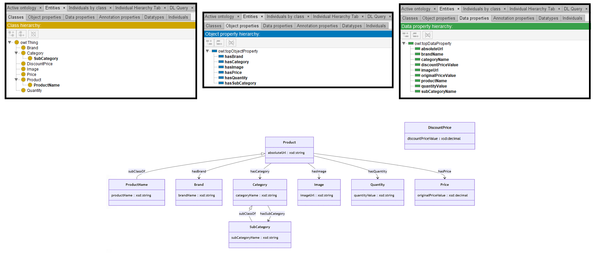

# Llama-3-70B

## Llama-3-70B-4bits

[Generated ontology](./ontology.txt)
 

### Errors

Ontology without syntax errors.

### [URIs](./ontology_URIs.xlsx)

| Prefix | URI                                           | Validity | Corrected |
|--------|-----------------------------------------------|----------|-----------|
| rdf    | http://www.w3.org/1999/02/22-rdf-syntax-ns#   | X        | -         |
| rdfs   | http://www.w3.org/2000/01/rdf-schema#         | X        | -         |
| owl    | http://www.w3.org/2002/07/owl#                | X        | -         |
| xsd    | http://www.w3.org/2001/XMLSchema#             | X        | -         |
|        |                                               | **4**    | **0**     |

| URI                  | Validity | Corrected            |
|----------------------|----------|----------------------|
| rdf:type (a)         | X        | -                    |
| rdfs:subClassOf      | X        | -                    |
| owl:Class            | X        | -                    |
| owl:ObjectProperty   | X        | -                    |
| owl:DatatypeProperty | X        | -                    |
| rdfs:domain          | X        | -                    |
| rdfs:range           | X        | -                    |
| xsd:decimal          | X        | -                    |
| xsd:string           | X        | -                    |
| *Total*              | **9**    | **0**                |