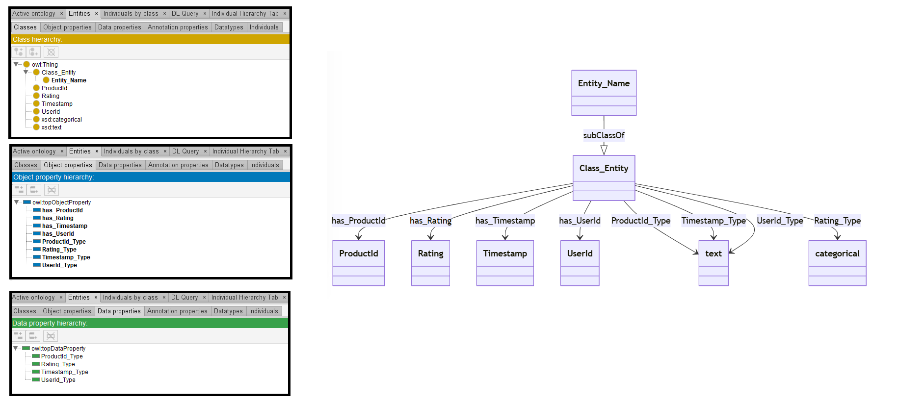
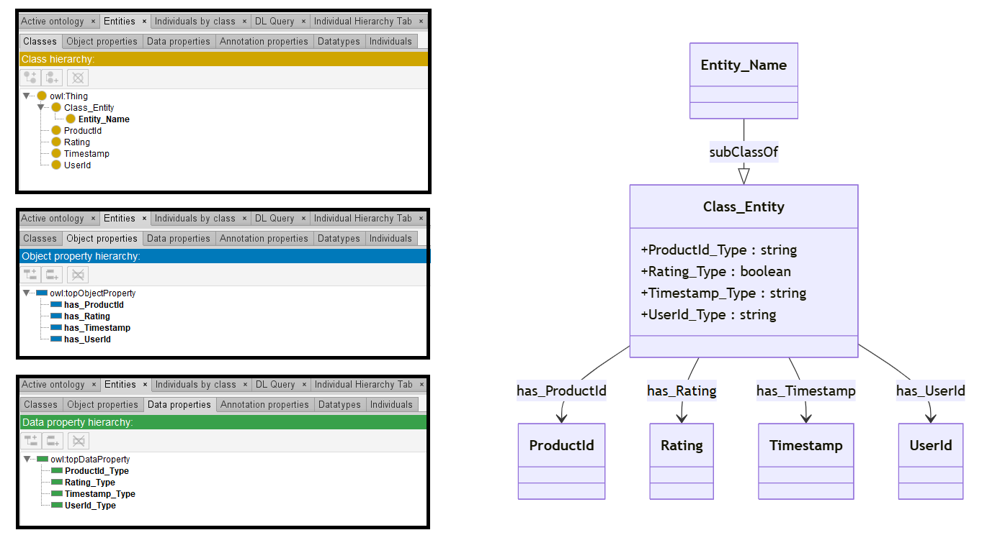
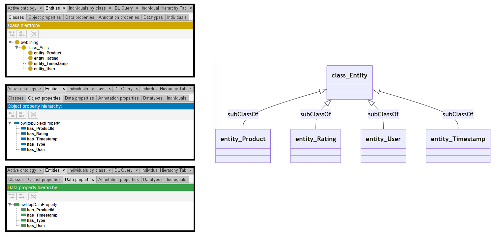

# Llama-3-8B

## Llama-3-8B-4bits

[Generated ontology](./4bits_ontology.txt)

### [Errors](./4bits_ontology_notes.txt)

**Incorrect format and serialization** (number of elements, dots). Example:
```
<https://base_ontology.com#entity_name>
        rdfs:subClassOf <https://base_ontology.com#class_entity>;
        owl:property <https://base_ontology.com#hasProductId>
            rdfs:domain <https://base_ontology.com#entity_name>;
            rdfs:range xsd:text;
```

## Llama-3-8B-8bits

[Generated ontology](./8bits_ontology.txt)
<br>

<br>
[Corrected ontology](./8bits_ontology_corrected.txt)
<br>



### [Errors](./8bits_ontology_notes.txt)

Ontology without syntax errors, but wrong URIs.


### [URIs](./8bits_ontology_URIs.xlsx)

| Prefix | URI                                           | Validity | Corrected |
|--------|-----------------------------------------------|----------|-----------|
| rdfs   | http://www.w3.org/2000/01/rdf-schema#         | X        | -         |
| owl    | http://www.w3.org/2002/07/owl#                | X        | -         |
| xsd    | http://www.w3.org/2001/XMLSchema#             | X        | -         |
|        |                                               | **3**    | **0**     |


| URI                  | Validity | Corrected            |
|----------------------|----------|----------------------|
| rdf:type (a)         | X        | -                    |
| owl:Ontology         | X        | -                    |
| owl:Class            | X        | -                    |
| rdfs:subClassOf      | X        | -                    |
| rdfs:domain          | X        | -                    |
| rdfs:range           | X        | -                    |
| owl:ObjectProperty   | X        | -                    |
| owl:DatatypeProperty | X        | -                    |
| xsd:text             | -        | xsd:string           |
| xsd:categorical      | -        | xsd:boolean          |
| *Total*              | **8**    | **2**                |


## Llama-3-8B-without quantization

[Generated ontology](./ontology.txt)
<br>
[Corrected ontology](./ontology_corrected.txt)
<br>



### [Errors](./ontology_notes.txt)

**Incorrect serialization:**
-   Missing end dots in the prefix declarations. Examples:
    ```
    @prefix owl: <http://www.w3.org/2002/07/owl#>
    @prefix xsd: <http://www.w3.org/2001/XMLSchema#>
    @prefix rdfs: <http://www.w3.org/2000/01/rdf-schema#>
    @prefix base: <https://base_ontology.com#>
    ```

### [URIs](./ontology_URIs.xlsx)

| Prefix | URI                                           | Validity | Corrected |
|--------|-----------------------------------------------|----------|-----------|
| rdfs   | http://www.w3.org/2000/01/rdf-schema#         | X        | -         |
| owl    | http://www.w3.org/2002/07/owl#                | X        | -         |
| xsd    | http://www.w3.org/2001/XMLSchema#             | X        | -         |
|        |                                               | **3**    | **0**     |

| URI                  | Validity | Corrected            |
|----------------------|----------|----------------------|
| rdf:type (a)         | X        | -                    |
| owl:Ontology         | X        | -                    |
| owl:Class            | X        | -                    |
| rdfs:subClassOf      | X        | -                    |
| rdfs:domain          | X        | -                    |
| rdfs:range           | X        | -                    |
| owl:ObjectProperty   | X        | -                    |
| xsd:string           | X        | -                    |
| *Total*              | **7**    | **0**                |