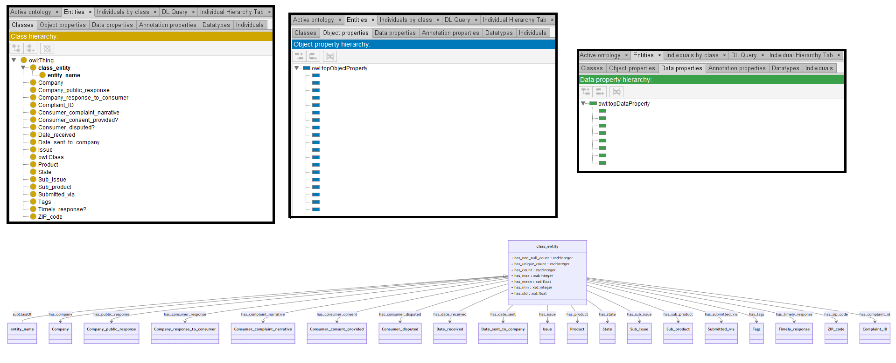

# Llama-3-8B

## Llama-3-8B-4bits

[Generated ontology](./4bits_ontology.txt)


### [Errors](./ontology_4bits_notes.txt)

Incorrect rdf/xml serialization.


## Llama-3-8B-8bits

[Generated ontology](./8bits_ontology.txt)
<br>
[Corrected ontology](./8bits_ontology_corrected.txt)
<br>



### [Errors](./ontology_8bits_notes.txt)

**Incorrect serialization:**
-   Lack of shortnames. Example:
    ```
    class_entity
        a owl:Class ;
        rdfs:label "class_entity".
    ```

### [URIs](./8bits_ontology_URIs.xlsx)

| Prefix | URI                                           | Validity | Corrected |
|--------|-----------------------------------------------|----------|-----------|
| rdf    | http://www.w3.org/1999/02/22-rdf-syntax-ns#   | X        | -         |
| owl    | http://www.w3.org/2002/07/owl#                | X        | -         |
| xsd    | http://www.w3.org/2001/XMLSchema#             | X        | -         |
|        |                                               | **3**    | **0**     |


| URI                  | Validity | Corrected            |
|----------------------|----------|----------------------|
| rdf:type (a)         | X        | -                    |
| owl:ontology         | X        | -                    |
| owl:Class            | X        | -                    |
| rdfs:comment         | X        | -                    |
| rdfs:label           | X        | -                    |
| rdfs:subClassOf      | X        | -                    |
| rdfs:domain          | X        | -                    |
| rdfs:range           | X        | -                    |
| owl:ObjectProperty   | X        | -                    |
| owl:DatatypeProperty | X        | -                    |
| xsd:integer          | X        | -                    |
| xsd:float            | X        | -                    |
| *Total*              | **12**   | **0**                |


## Llama-3-8B-without quantization

[Generated ontology](./ontology.txt)
<br>
[Corrected ontology](./ontology_corrected.txt)
<br>


### [Errors](./ontology_8bits_notes.txt)

**Incorrect serialization:**
-   Missing ending dots in the prefixes. Example:
    ```
    @prefix owl: <http://www.w3.org/2002/07/owl#>
    ```

-   Incorrect use of commas instead of semicolons. Example:
    ```
    has_company a owl:ObjectProperty, rdfs:domain <http://www.example.org/ontology#entity_name>, rdfs:range xsd:integer.
    ```

-   Incorrect use of shortnames. Example: has_company in the previous statement.

**Wrong URIs.** Example: owl:Categorical


### [URIs](./8bits_ontology_URIs.xlsx)

| Prefix | URI                                           | Validity | Corrected |
|--------|-----------------------------------------------|----------|-----------|
| rdf    | http://www.w3.org/1999/02/22-rdf-syntax-ns#   | X        | -         |
| rdfs   | http://www.w3.org/2000/01/rdf-schema#         | X        | -         |
| owl    | http://www.w3.org/2002/07/owl#                | X        | -         |
| xsd    | http://www.w3.org/2001/XMLSchema#             | X        | -         |
|        |                                               | **4**    | **0**     |


| URI                  | Validity | Corrected            |
|----------------------|----------|----------------------|
| rdf:type (a)         | X        | -                    |
| owl:Class            | X        | -                    |
| rdfs:subClassOf      | X        | -                    |
| rdfs:domain          | X        | -                    |
| rdfs:range           | X        | -                    |
| owl:ObjectProperty   | X        | -                    |
| owl:DatatypeProperty | X        | -                    |
| owl:Categorical      | -        | xsd:boolean          |
| xsd:integer          | X        | -                    |
| xsd:float            | X        | -                    |
| xsd:string           | X        | -                    |
| *Total*              | **10**   | **0**                |