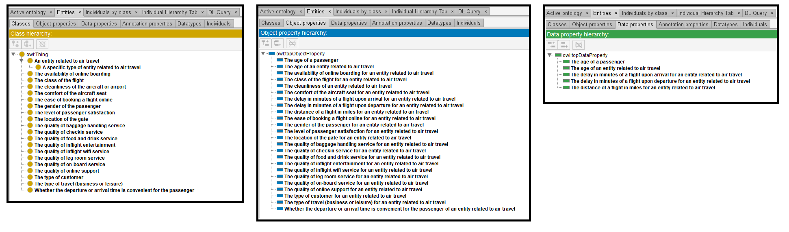

# Mistral-7B

[Generated ontology](./ontology.txt)
 
[Corrected ontology](./ontology_corrected.txt)
 

## Errors

Incorrect serialization:
-   Namespace prefix 'owl' used but not defined.

-   Use of https://myairlineontology.com# and https://myairlineontology.com/ 

-   Wrong URIs, like rdf:label or rdf:subclass_of

## URIs

| Prefix | URI                                           | Validity | Corrected |
|--------|-----------------------------------------------|----------|-----------|
| rdf    | http://www.w3.org/1999/02/22-rdf-syntax-ns#   | X        | -         |
| xsd    | http://www.w3.org/2001/XMLSchema#             | X        | -         |
|        |                                               | **2**    | **0**     |

| URI                  | Validity | Corrected            |
|----------------------|----------|----------------------|
| rdf:type (a)         | X        | -                    |
| rdf:label            | -        | rdfs:label           |
| rdf:subclass_of      | -        | rdfs:subClassOf      |
| rdf:domain           | -        | rdfs:domain          |
| rdf:range            | -        | rdfs:range           |
| owl:Class            | X        | -                    |
| owl:ObjectProperty   | X        | -                    |
| xsd:int              | -        | xsd:integer          |
| *Total*              | **3**    | **5**                |

- Use of rdf:label as dc:description or rdfs:comment