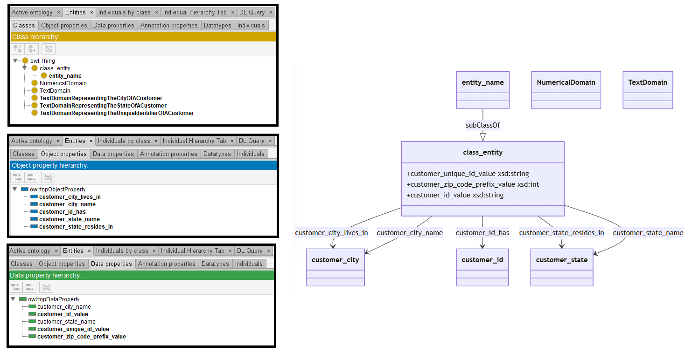

# Mistral-7B

[Generated ontology](./ontology.txt)
<br>
[Corrected ontology](./ontology_corrected.txt)
<br>



## Errors

Incorrect serialization:
-   Incorrect use of shortnames, like TextDomain and NumericalDomain. Examples:
    ```
    :customer_id a TextDomain .
    :customer_zip_code_prefix a NumericalDomain .
    ```

Wrong URIs. Example: owl:DataProperty


## URIs

| Prefix | URI                                           | Validity | Corrected |
|--------|-----------------------------------------------|----------|-----------|
| rdf    | http://www.w3.org/1999/02/22-rdf-syntax-ns/   | -        | http://www.w3.org/1999/02/22-rdf-syntax-ns# |
| rdfs   | http://www.w3.org/2000/01/rdf-schema/         | -        | http://www.w3.org/2000/01/rdf-schema#       |
| owl    | http://www.w3.org/2002/07/owl/                | -        | http://www.w3.org/2002/07/owl#              |
| xsd    | http://www.w3.org/2001/XMLSchema#             | X        | -         |
|        |                                               | **1**    | **3**     |


| URI                  | Validity | Corrected            |
|----------------------|----------|----------------------|
| rdf:type (a)         | X        | -                    |
| owl:Class            | X        | -                    |
| rdfs:subClassOf      | X        | -                    |
| rdfs:label           | X        | -                    |
| rdfs:domain          | X        | -                    |
| rdfs:range           | X        | -                    |
| owl:ObjectProperty   | X        | -                    |
| owl:DataProperty     | -        | owl:DatatypeProperty |
| xsd:string           | X        | -                    |
| xsd:int              | X        | -                    |
| *Total*              | **9**    | **1**                |

- Use of rdf:label as dc:description or rdfs:comment