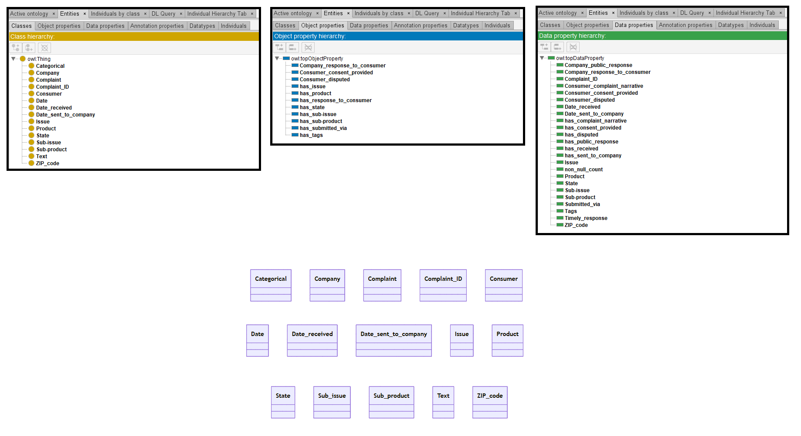

# Mistral-7B

[Generated ontology](./ontology.txt)
<br>
[Corrected ontology](./ontology_corrected.txt)
<br>



## [Errors](./ontology_notes.txt)

**Incorrect serialization:**
-   Incorrect IDs with spaces between words. Examples:
    <br>
    :Company public response
    <br>
    :Consumer complaint narrative

-   Number of elements:
    ```
    :Issue :type
    a owl:DatatypeProperty ;
    rdf:domain :Issue ;
    rdf:range :Text .
    ```

**Wrong URIs.** Example: rdf:label


## [URIs](./ontology_URIs.xlsx)

| Prefix | URI                                           | Validity | Corrected |
|--------|-----------------------------------------------|----------|-----------|
| rdf    | http://www.w3.org/1999/02/22-rdf-syntax-ns/   | -        | http://www.w3.org/1999/02/22-rdf-syntax-ns# |
| rdfs   | http://www.w3.org/2000/01/rdf-schema/         | -        | http://www.w3.org/2000/01/rdf-schema#       |
| owl    | http://www.w3.org/2002/07/owl#                | X        | -         |
| xsd    | http://www.w3.org/2001/XMLSchema#             | X        | -         |
|        |                                               | **2**    | **2**     |


| URI                  | Validity | Corrected            |
|----------------------|----------|----------------------|
| rdf:type (a)         | X        | -                    |
| owl:Class            | X        | -                    |
| rdf:label            | -        | rdfs:label           |
| rdf:DatatypeProperty | -        | owl:DatatypeProperty |
| owl:DatatypeProperty | X        | -                    |
| rdf:propertyType     | -        | :propertyType        |
| rdf:domain           | -        | rdfs:domain          |
| rdf:range            | -        | rdfs:range           |
| rdf:subClassOf       | -        | rdfs:subClassOf      |
| rdf:ObjectProperty   | -        | owl:ObjectProperty   |
| owl:ObjectProperty   | X        | -                    |
| xsd:string           | X        | -                    |
| *Total*              | **5**    | **7**                |