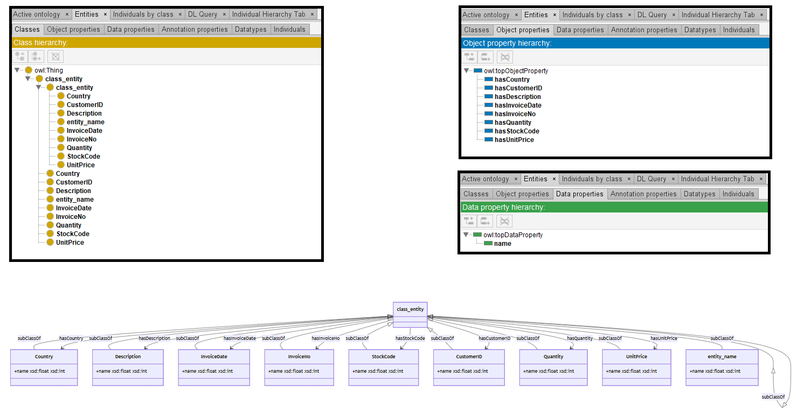

# Mistral-7B

[Generated ontology](./ontology.txt)
<br>
[Corrected ontology](./ontology_corrected.txt)
<br>



## Errors

Incorrect serialization:
-   Lack of dots in the prefix declarations. Examples:
    ```
    @prefix base: <https://base_ontology.com/>
    @prefix rdf: <http://www.w3.org/1999/02/22-rdf-syntax-ns/>
    @prefix rdfs: <http://www.w3.org/2000/01/rdf-schema/>
    @prefix owl: <http://www.w3.org/2002/07/owl#>
    ```
    
-   Prefix xsd used but not defined.

-   Incorrect use of shortnames, like class_entity. Example:
    ```
    class_entity a owl:Class ;
    rdfs:subClassOf class_entity .
    ```

-   Incorrect number of elements in the triples. Example:
    ```
    name a rdf:Property ;
    domain StockCode ;
    range rdfs:Literal ;
    rdf:typedBy rdf:XMLSchema datatype "http://www.w3.org/2001/XMLSchema#string" ;
    rdf:label "name" .
    ```

Wrong URIs. Example: rdf:typedBy or rdf:XMLSchema


## URIs

| Prefix | URI                                           | Validity | Corrected |
|--------|-----------------------------------------------|----------|-----------|
| rdf    | http://www.w3.org/1999/02/22-rdf-syntax-ns/   | -        | http://www.w3.org/1999/02/22-rdf-syntax-ns# |
| rdfs   | http://www.w3.org/2000/01/rdf-schema/         | -        | http://www.w3.org/2000/01/rdf-schema#       |
| owl    | http://www.w3.org/2002/07/owl#                | X        | -         |
| xsd    | http://www.w3.org/2001/XMLSchema#             | X        | -         |
|        |                                               | **2**    | **2**     |


| URI                  | Validity | Corrected            |
|----------------------|----------|----------------------|
| rdf:namespace        | -        | :namespace           |
| rdf:type (a)         | X        | -                    |
| owl:Class            | X        | -                    |
| rdf:label            | -        | rdfs:label           |
| rdfs:subClassOf      | X        | -                    |
| rdf:Property         | X        | -                    |
| rdfs:Literal         | X        | -                    |
| rdf:typedBy          | -        | :typedBy             |
| rdf:XMLSchema        | -        | :XMLSchema           |
| xsd:int              | X        | -                    |
| xsd:float            | X        | -                    |
| *Total*              | **7**    | **4**                |