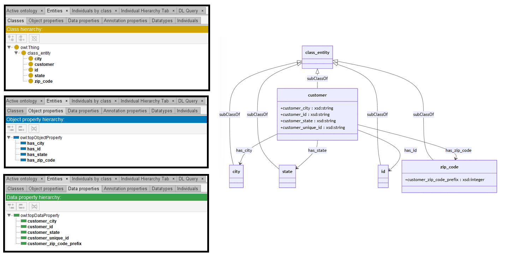

# Mixtral-8-7B

[Generated ontology](./ontology.txt)
<br>
[Corrected ontology](./ontology_corrected.txt)
<br>



## [Errors](./ontology_notes.txt)

**Incorrect serialization:**
-   Incorrect declaration of prefixes:
    ```
    <http://www.w3.org/1999/02/22-rdf-syntax-ns#>, <http://www.w3.org/2000/01/rdf-schema#>, <http://www.w3.org/2002/07/owl#>, <https://base_ontology.com#>, <http://www.w3.org/2001/XMLSchema#>
    ```

-   Incorrect use of shortnames (without prefixes) and number of elements in the triples. Example:
    ```
    state owl:Class ;
        rdfs:subClassOf class_entity ;
        rdfs:comment "Subclass of class_entity representing state" .
    ```
    
**Wrong URIs.** Example: rdf:about


## [URIs](./ontology_URIs.xlsx)

| Prefix | URI                                           | Validity | Corrected |
|--------|-----------------------------------------------|----------|-----------|
| rdf    | http://www.w3.org/1999/02/22-rdf-syntax-ns#   | X        | -         |
| rdfs   | http://www.w3.org/2000/01/rdf-schema#         | X        | -         |
| owl    | http://www.w3.org/2002/07/owl#                | X        | -         |
| xsd    | http://www.w3.org/2001/XMLSchema#             | X        | -         |
|        |                                               | **4**    | **0**     |


| URI                  | Validity | Corrected            |
|----------------------|----------|----------------------|
| rdf:type (a)         | X        | -                    |
| rdf:about            | -        | :about               |
| rdfs:subClassOf      | X        | -                    |
| rdfs:comment         | X        | -                    |
| rdfs:domain          | X        | -                    |
| rdfs:range           | X        | -                    |
| owl:Ontology         | X        | -                    |
| owl:Class            | X        | -                    |
| owl:versionInfo      | X        | -                    |
| xsd:string           | X        | -                    |
| xsd:integer          | X        | -                    |
| *Total*              | **10**   | **1**                |