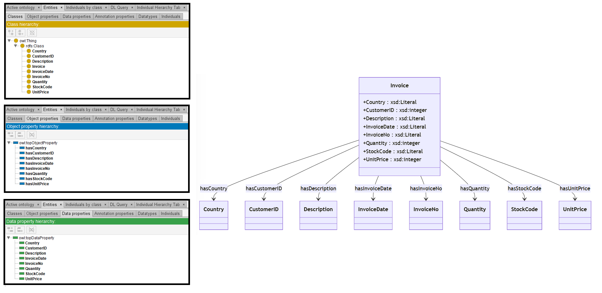

# Mixtral-8-7B

[Generated ontology](./ontology.txt)
<br>
[Corrected ontology](./ontology_corrected.txt)
<br>



## Errors

Incorrect serialization:
-   Incorrect prefix declarations. Examples:
    ```
    Prefix: base = <https://base_ontology.com#>
    ```

-   Incorrect use of shortnames. Example:
    ```
    base:Invoice 
    SubClassOf rdfs:Class.
    ```

-   Lack of ending dots at the end of the prefix declarations and other statements.

-   Incorrect sintaxis. Example:
    ```
    Class: base:Invoice
    ```

Wrong IDs. Example: SubClassOf instead of subClassOf.


## URIs

| Prefix | URI                                           | Validity | Corrected |
|--------|-----------------------------------------------|----------|-----------|
| rdf    | http://www.w3.org/1999/02/22-rdf-syntax-ns#   | X        | -         |
| rdfs   | http://www.w3.org/2000/01/rdf-schema#         | X        | -         |
| owl    | http://www.w3.org/2002/07/owl#                | X        | -         |
| xsd    | http://www.w3.org/2001/XMLSchema#             | X        | -         |
|        |                                               | **4**    | **0**     |


| URI                    | Validity | Corrected            |
|------------------------|----------|----------------------|
| rdf:type (a)           | X        | -                    |
| owl:Ontology           | X        | -                    |
| owl:FunctionalProperty | X        | -                    |
| rdfs:Class             | X        | -                    |
| rdf:Property           | X        | -                    |
| rdfs:Literal           | X        | -                    |
| xsd:integer            | X        | -                    |
| *Total*                | **7**    | **0**                |