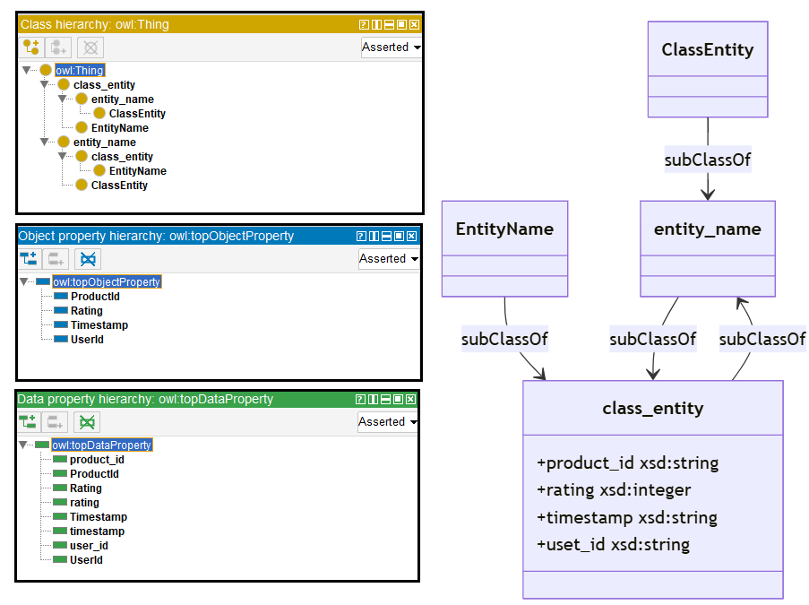
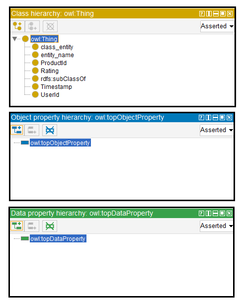

# Llama-2-13B

## Llama-2-13B-4bits

[Generated ontology](./ontology_4bits.txt)


### [Errors](./ontology_4bits_notes.txt)

-   **Incorrect format** and serialization due to lack of shortnames, IDs and dots. Example:
    ```
    entity_name (subclassOf: class_entity)
        domain: entity_name; range: owl:String
    ```


## Llama-2-13B-8bits

[Generated ontology](./ontology_8bits.txt)
<br>
[Corrected ontology](./ontology_8bits_corrected.txt)
<br>



### [Errors](./ontology_8bits_notes.txt)

-   **Uncommented text** at the begining and ending of the ontology:<br>
    ```
    Sure, here is the TURTLE syntax content for the proposed ontology, without any condensing or shortening, and with strict compliance to the instructions provided:<br>
    ...
    Ontology
    ...
    Note that I have not included any labels or comments or descriptions, as requested. Also, I have not added any instances to the ontology.
    ```

-   **Wrong URIs** due to the use of inappropriate prefixes and IDs. Examples: rdf:domain and rdf:range instead of rdfs:domain and rdfs:range, and owl:DataProperty instead of owl:DatatypeProperty.


### [URIs](./ontology_8bits_URIs.xlsx)

| Prefix | URI                                           | Validity | Corrected |
|--------|-----------------------------------------------|----------|-----------|
| rdf    | http://www.w3.org/1999/02/22-rdf-syntax-ns#   | X        | -         |
| rdfs   | http://www.w3.org/2000/01/rdf-schema#         | X        | -         |
| owl    | http://www.w3.org/2002/07/owl#                | X        | -         |
| xsd    | http://www.w3.org/2001/XMLSchema#             | X        | -         |
|        |                                               | **4**    | **0**     |

| URI                | Validity | Corrected            |
|--------------------|----------|----------------------|
| owl:Ontology       | X        | -                    |
| owl:Class          | X        | -                    |
| owl:ObjectProperty | X        | -                    |
| owl:DataProperty   | -        | owl:DatatypeProperty |
| owl:hasSelf        | X        | -                    |
| rdfs:subClassOf    | X        | -                    |
| rdf:domain         | -        | rdfs:domain          |
| rdf:range          | -        | rdfs:range           |
| rdf:type (a)       | X        | -                    |
| xsd:string         | X        | -                    |
| xsd:integer        | X        | -                    |
| *Total*            | **8**    | **3**                |

-   owl:hasSelf used in an inappropriate way.
-   Multiple Datatype Properties and Object Properties use the same URIs.


## Llama-2-13B without quantization

[Generated ontology](./ontology_all.txt)
<br>
[Corrected ontology](./ontology_all_corrected.txt)
<br>


### [Errors](./ontology_all_notes.txt)

-   **Incorrect serialization** due to the number of elements in the triples. Example:
    ```
    <http://example.com/ontology/ProductReview/class_entity> owl:has_key owl:ObjectProperty <http://example.com/ontology/ProductReview/name> .
    ```

-    **Uncommented text:** <br>
     Sure, here is the thorough and exhaustive TURTLE syntax content for the proposed ontology, without condensing or shortening any part of it, ensuring strict compliance with the instructions provided:
	
-   **Wrong URIs.** Example: owl:SubClassOf instead of rdfs:subClassOf.


### [URIs](./ontology_all_URIs.xlsx)

| Prefix | URI                                           | Validity | Corrected |
|--------|-----------------------------------------------|----------|-----------|
| rdf    | http://www.w3.org/1999/02/22-rdf-syntax-ns#   | X        | -         |
| owl    | http://www.w3.org/2002/07/owl#                | X        | -         |
| xsd    | http://www.w3.org/2001/XMLSchema#             | X        | -         |
|        |                                               | **3**    | **0**     |

| URI             | Validity | Corrected       |
|-----------------|----------|-----------------|
| owl:Ontology    | X        | -               |
| owl:Class       | X        | -               |
| owl:SubClassOf  | -        | rdfs:subClassOf |
| owl:has_key     | -        | owl:hasKey      |
| owl:has_value   |          | owl:hasValue    |
| rdf:type (a)    | X        | -               |
| *Total*         | **3**    | **3**           |

-   owl:has_key (owl:hasKey) and owl:has_value (owl:hasValue) used in an inappropriate way.
-   owl:SubClassOf (rdfs:subClassOf) used as node instead of such property.

