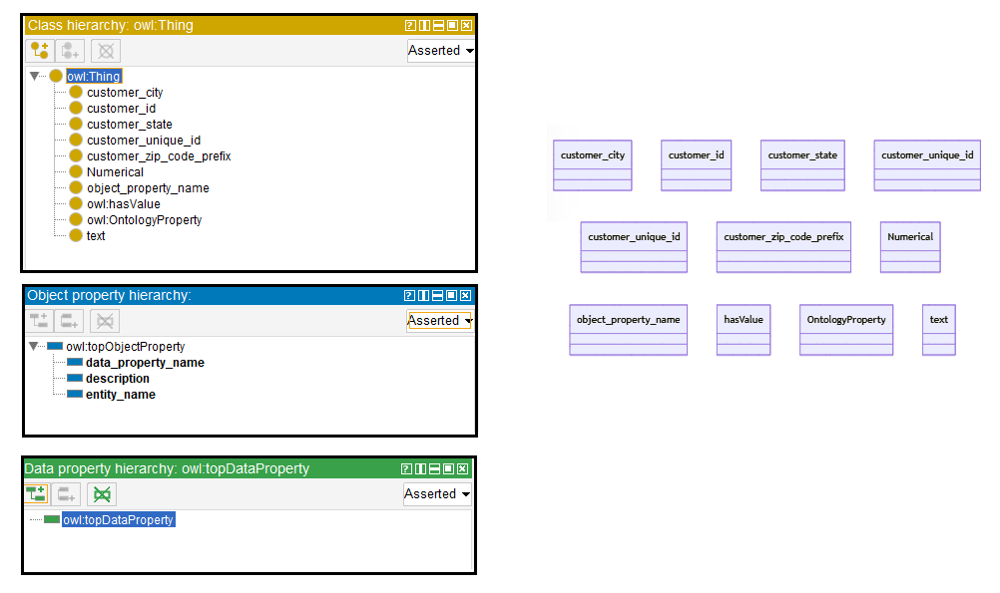
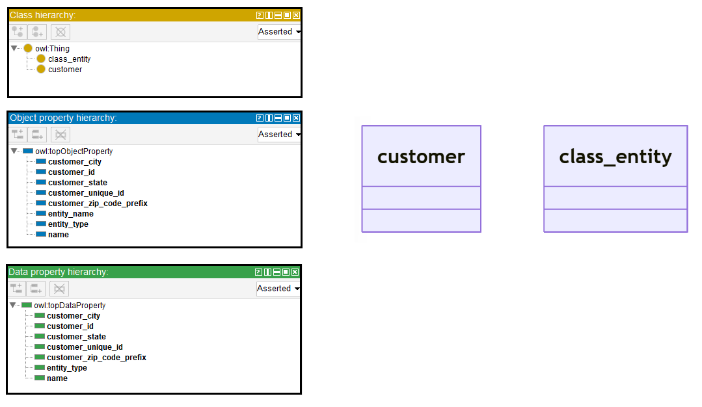
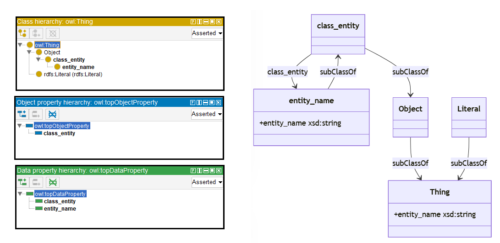

# Llama-2-13B

## Llama-2-13B-4bits

[Generated ontology](./ontology_4bits.txt)
<br>
[Corrected ontology](./ontology_4bits_corrected.txt)
<br>


### [Errors](./ontology_4bits_notes.txt)

-   **Incorrect format and serialization** (number of elements, shortnames and dots). Example:
    ```
    class class_entity {
        owl:ontologyProperty rdf:type owl:Class .
        owl:hasValue rdf:type owl:Class .
        owl:inverseOf rdf:type owl:Property .
    }
    ```

-   **Wrong URIs.** Example: owl:ontologyProperty instead of owl:OntologyProperty. Some URIs are also used incorrectly.


### [URIs](./ontology_4bits_URIs.xlsx)

| Prefix | URI                                           | Validity | Corrected |
|--------|-----------------------------------------------|----------|-----------|
| rdf    | http://www.w3.org/1999/02/22-rdf-syntax-ns#   | X        | -         |
| owl    | http://www.w3.org/2002/07/owl#                | X        | -         |
| rdfs   | http://www.w3.org/2000/01/rdf-schema#         | X        | -         |
|        |                                               | **3**    | **0**     |

| URI                  | Validity | Corrected           |
|----------------------|---------|----------------------|
| rdf:type (a)         | X       | -                    |
| owl:ontologyProperty | -       | owl:OntologyProperty |
| owl:Class            | X       | -                    |
| owl:hasValue         | X       | -                    |
| owl:inverseOf        | X       | -                    |
| owl:Property         | -       | rdf:Property         |
| *Total*              | **4**   | **2**                |

-   owl:OntologyProperty, owl:hasValue, owl:inverseOf, and owl:Property used incorrectly.


## Llama-2-13B-8bits

[Generated ontology](./ontology_8bits.txt)
<br>
[Corrected ontology](./ontology_8bits_corrected.txt)
<br>



### [Errors](./ontology_8bits_notes.txt)

-   **Incorrect format and serialization** (number of elements, shortnames, dots, URI format). Example:
    ```
    data_property (entity_type) a owl:DataProperty .
        domain (http://baseontology.com/customer)
        range (Text)
    ```

-   **Uncommented text:** <br>
    Sure, here is the TURTLE syntax content for the proposed ontology based on the provided JSON data table and schema:

-   **Wrong URIs** and used incorrectly. Example: owl:DataProperty


### [URIs](./ontology_4bits_URIs.xlsx)

| Prefix | URI                                           | Validity | Corrected |
|--------|-----------------------------------------------|----------|-----------|
| rdf    | http://www.w3.org/1999/02/22-rdf-syntax-ns#   | X        | -         |
| owl    | http://www.w3.org/2002/07/owl#                | X        | -         |
| xsd    | http://www.w3.org/2001/XMLSchema#             | X        | -         |
|        |                                               | **3**    | **0**     |

| URI                | Validity | Corrected            |
|--------------------|----------|----------------------|
| rdf:type (a)       | X        | -                    |
| owl:Class          | X        | -                    |
| owl:ObjectProperty | X        | -                    |
| owl:DataProperty   | -        | owl:DatatypeProperty |
| *Total*            | **3**    | **1**                |

-   ObjectProperty and DatatypeProperty with the same URIs.


## Llama-2-13B without quantization

[Generated ontology](./ontology_all.txt)
<br>
[Corrected ontology](./ontology_all_corrected.txt)
<br>



### [Errors](./ontology_all_notes.txt)

-   **Incorrect serialization** (number of elements, shortnames, dots): 
    ```
    class entity_name
        subClassOf class_entity.
        domain owl:Thing.
        range owl:String.
    ```
   
-   **Wrong URIs.** Example: owl:String. Some classes and properties share the same URIs.

-   **Uncommented text:** 
    Sure, here is the TURTLE syntax content for the proposed ontology based on the provided JSON data and input related data description:


### [URIs](./ontology_all_URIs.xlsx)

| Prefix | URI                                           | Validity | Corrected |
|--------|-----------------------------------------------|----------|-----------|
| rdf    | http://www.w3.org/1999/02/22-rdf-syntax-ns#   | X        | -         |
| owl    | http://www.w3.org/2002/07/owl#                | X        | -         |
| rdfs   | http://www.w3.org/2000/01/rdf-schema#         | X        | -         |
|        |                                               | **3**    | **0**     |

| URI           | Validity | Corrected    |
|---------------|----------|--------------|
| owl:Object    | -        | :Object      |
| owl:Thing     | X        | -            |
| owl:String    | -        | xsd:string   |
| owl:Literal   | -        | rdfs:Literal |
| owl:hasValue  | X        | -            |
| *Total*       | **2**    | **3**        |

-   owl:hasValue used incorrectly.

