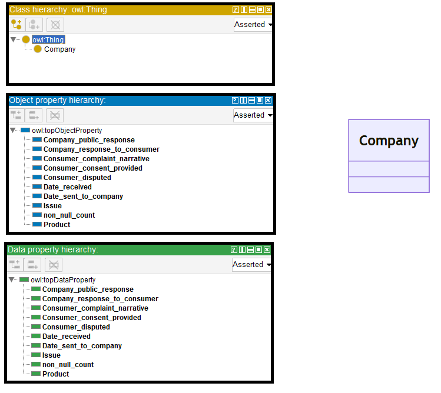
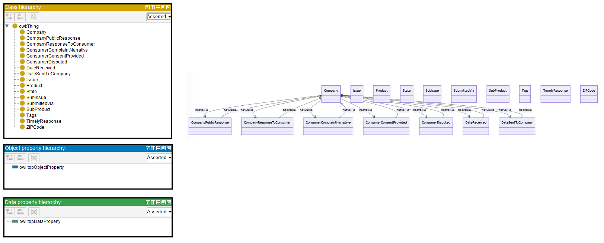

# Llama-2-13B

## Llama-2-13B-4bits

[Generated ontology](./ontology_4bits.txt)


### [Errors](./ontology_4bits_notes.txt)

-   **Incorrect format and serialization** (shortnames, dots). Example:
    ```
    class CompanyPublicResponse {
        owl:Class(CompanyPublicResponse)
        rdf:type owl:Class
        xsd:string text
        owl:oneOf(
            owl:NamedIndividual(CompanyPublicResponse)
        )
    }
    ```

-   **Wrong URIs.**


## Llama-2-13B-8bits

[Generated ontology](./ontology_8bits.txt) 
<br>
[Corrected ontology](./ontology_8bits_corrected.txt)
<br>



### [Errors](./ontology_8bits_notes.txt)

-   **Uncommented text:** <br>
    Here is the proposed ontology for the given JSON data in TURTLE syntax:

-   **Incorrect serialization** due to a loop at the end of the file:
    ```
    <http://baseontology.com/Company> owl:hasValue <http://baseontology.com/non_null_count": 35699984167, "type": "text": "3", "3": "3" ...
    ```

-   **Wrong URIs** and used incorrectly. Example: owl:domain


### [URIs](./ontology_8bits_URIs.xlsx)

| Prefix | URI                                         | Validity | Corrected |
|--------|---------------------------------------------|----------|-----------|
| rdf    | http://www.w3.org/1999/02/22-rdf-syntax-ns# | X        | -         |
| owl    | http://www.w3.org/2002/07/owl#              | X        | -         |
| xsd    | http://www.w3.org/2001/XMLSchema#           | X        | -         |
|        |                                             | **3**    | **0**     |

| URI                | Validity | Corrected   |
|--------------------|----------|-------------|
| owl:Ontology       | X        | -           |
| owl:imports        | X        | -           |
| owl:Class          | X        | -           |
| owl:class          | -        | owl:Class   |
| owl:hasValue       | X        | -           |
| owl:ObjectProperty | X        | -           |
| owl:domain         | -        | rdfs:domain |
| owl:range          | -        | rdfs:range  |
| xsd:integer        | X        | -           |
| xsd:string         | X        | -           |
| xsd:boolean        | X        | -           |
| rdf:type (a)       | X        | -           |
| *Total*            | **9**    | **3**       |

-   owl:hasValue used incorrectly.
-   ObjectProperties and DatatypeProperties share the same URIs.


## Llama-2-13B without quantization

[Generated ontology](./ontology_all.txt)
<br>
[Corrected ontology](./ontology_all_corrected.txt)
<br>



### [Errors](./ontology_all_notes.txt)

-   **Incorrect serialization** (number of elements and ending loop). Example: 
    ```
    <http://example.com/Company> owl:type owl:Class> ,
    ...
    <http://example.com/Company> owl:Class> , 
    <http://Company> owl:Class> , 
    <http://Company> , 
    ...
    ```
    
-   **Uncommented text.** Example: <br>
    Here is the TURTLE syntax for the proposed ontology:

-   **Wrong URIs** and incorrect use. Example: owl:has_value instead of owl:hasValue.

-   Statements duplicated. Example: <br>
    ```
    <http://example.com/CompanyPublicResponse> a owl:Class .
    <http://example.com/CompanyPublicResponse> rdf:type owl:Class .
    ```


### [URIs](./ontology_all_URIs.xlsx)

| Prefix | URI                                         | Validity | Corrected |
|--------|---------------------------------------------|----------|-----------|
| rdf    | http://www.w3.org/1999/02/22-rdf-syntax-ns# | X        | -         |
| owl    | http://www.w3.org/2002/07/owl#              | X        | -         |
| xsd    | http://www.w3.org/2001/XMLSchema#           | X        | -         |
|        |                                             | **3**    | **0**     |

| URI           | Validity | Corrected    |
|---------------|---------|---------------|
| rdf:type      | X       | -             |
| owl:Class     | X       | -             |
| owl:has_value | -       | owl:hasValue  |
| *Total*       | **2**   | **1**         |

-   owl:hasValue used incorrectly.