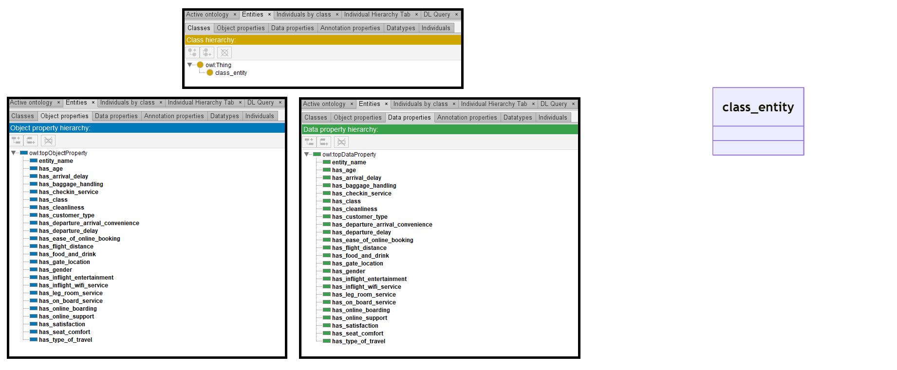
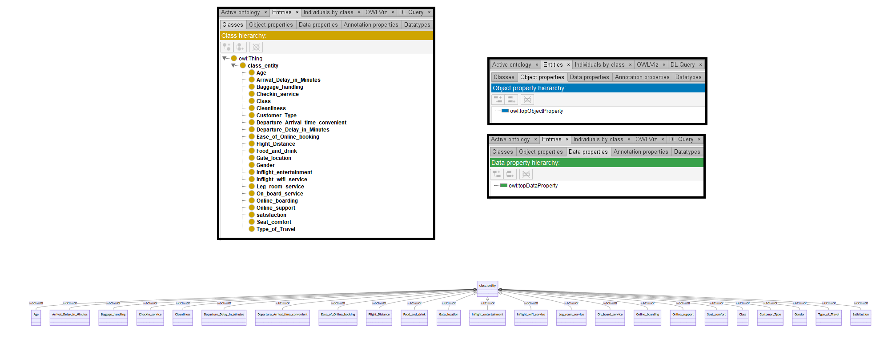

# Llama-3-8B

## Llama-3-8B-4bits

[Generated ontology](./ontology_4bits.txt)

### [Errors](./ontology_4bits_notes.txt)

Incorrect rdf/xml serialization


## Llama-3-8B-8bits

[Generated ontology](./ontology_8bits.txt)
<br>
[Corrected ontology](./ontology_8bits_corrected.txt)
<br>



### [Errors](./ontology_8bits_notes.txt)

**Incorrect serialization:**
-   Incorrect number of elements in the triples. Example:
    <br>
    base_ontology:class_entity owl:Class.


### [URIs](./ontology_8bits_URIs.xlsx)

| Prefix | URI                                           | Validity | Corrected |
|--------|-----------------------------------------------|----------|-----------|
| rdfs   | http://www.w3.org/2000/01/rdf-schema#         | X        | -         |
| owl    | http://www.w3.org/2002/07/owl#                | X        | -         |
| xsd    | http://www.w3.org/2001/XMLSchema#             | X        | -         |
|        |                                               | **3**    | **0**     |


| URI                 | Validity | Corrected            |
|---------------------|----------|----------------------|
| owl:Class           | X        | -                    |
| rdfs:domain         | X        | -                    |
| rdfs:range          | X        | -                    |
| owl:ObjectProperty  | X        | -                    |
| xsd:string          | X        | -                    |
| xsd:integer         | X        | -                    |
| *Total*             | **6**    | **0**                |


## Llama-3-8B-without quantization

[Generated ontology](./ontology_all.txt)
<br>
[Corrected ontology](./ontology_all_corrected.txt)
<br>



### [Errors](./ontology_all_notes.txt)

**Incorrect serialization:**
-   Incorrect use of shortnames. Example:
    ```
    @prefix class_entity: <https://base_ontology.com#class_entity>.
    
    class_entity rdfs:subClassOf owl:Thing.
    ```

### [URIs](./ontology_all_URIs.xlsx)

| Prefix | URI                                           | Validity | Corrected |
|--------|-----------------------------------------------|----------|-----------|
| dc     | https://purl.org/dc/terms/                    | X        | -         |
| rdfs   | http://www.w3.org/2000/01/rdf-schema#         | X        | -         |
| owl    | http://www.w3.org/2002/07/owl#                | X        | -         |
| xsd    | http://www.w3.org/2001/XMLSchema#             | X        | -         |
|        |                                               | **4**    | **0**     |

| URI                 | Validity | Corrected            |
|---------------------|----------|----------------------|
| owl:Thing           | X        | -                    |
| rdfs:subClassOf     | X        | -                    |
| *Total*             | **2**    | **0**                |