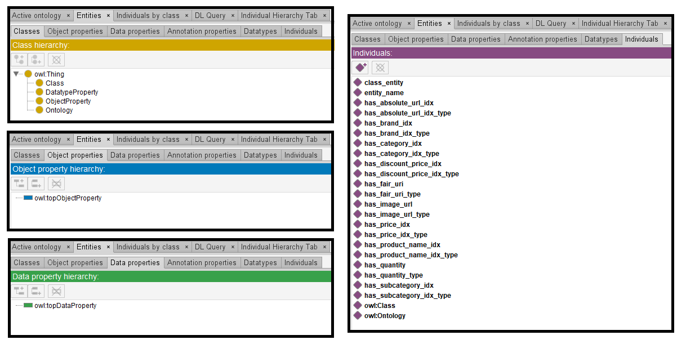
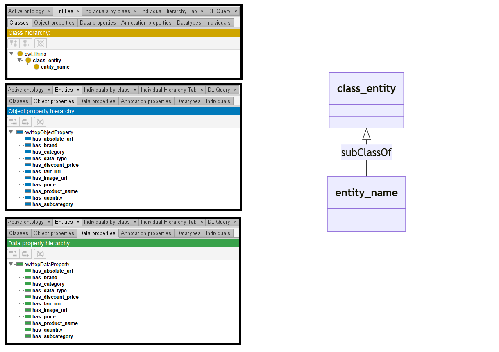

# Llama-3-8B

## Llama-3-8B-4bits

[Generated ontology](./4bits_ontology.txt)
<br>
[Corrected ontology](./4bits_ontology_corrected.txt)
<br>



### [Errors](./ontology_4bits_notes.txt)

**Incorrect serialization:**
-   Missing end dots in the prefix declarations. Example:
    ```
    @prefix owl: <https://www.w3.org/2002/07/owl#>
    @prefix xsd: <http://www.w3.org/2001/XMLSchema#>
    @prefix rdfs: <https://www.w3.org/2000/01/rdf-schema#>
    @prefix base: <https://base_ontology.com/>
    ```

**Wrong URIs.** Example: owl:subClassOf


### [URIs](./4bits_ontology_URIs.xlsx)

| Prefix | URI                                           | Validity | Corrected |
|--------|-----------------------------------------------|----------|-----------|
| rdfs   | http://www.w3.org/2000/01/rdf-schema#         | X        | -         |
| owl    | http://www.w3.org/2002/07/owl#                | X        | -         |
| xsd    | http://www.w3.org/2001/XMLSchema#             | X        | -         |
|        |                                               | **3**    | **0**     |

| URI                  | Validity | Corrected            |
|----------------------|----------|----------------------|
| rdf:type (a)         | X        | -                    |
| rdfs:label           | X        | -                    |
| owl:Class            | X        | -                    |
| owl:subClassOf       | -        | rdfs:subClassOf      |
| owl:domain           | -        | rdfs:domain          |
| owl:range            | -        | rdfs:range           |
| owl:ObjectProperty   | X        | -                    |
| owl:DatatypeProperty | X        | -                    |
| xsd:float            | X        | -                    |
| xsd:string           | X        | -                    |
| *Total*              | **7**    | **3**                |


## Llama-3-8B-8bits

[Generated ontology](./8bits_ontology.txt)
<br>

<br>
[Corrected ontology](./8bits_ontology_corrected.txt)
<br>



### [Errors](./ontology_8bits_notes.txt)

**Incorrect serialization:**
-   Incorrect number of elements in the triples and missing semicolons. Example:
    ```
    base_ontology:has_absolute_url owl:ObjectProperty
        owl:domain base_ontology:class_entity
        owl:range xsd:integer.
    ```

-   Prefix declaration: 
    ```
    @prefix base_ontology: <https://base_ontology.com#ontology.owl>.
    ```

**Wrong URIs.** Example: owl:subclassOf


### [URIs](./8bits_ontology_URIs.xlsx)

| Prefix | URI                                           | Validity | Corrected |
|--------|-----------------------------------------------|----------|-----------|
| rdf    | http://www.w3.org/1999/02/22-rdf-syntax-ns#   | X        | -         |
| owl    | http://www.w3.org/2002/07/owl#                | X        | -         |
| xsd    | http://www.w3.org/2001/XMLSchema#             | X        | -         |
|        |                                               | **3**    | **0**     |


| URI                  | Validity | Corrected            |
|----------------------|----------|----------------------|
| owl:subclassOf       | -        | rdfs:subClassOf      |
| owl:Thing            | X        | -                    |
| owl:ObjectProperty   | X        | -                    |
| owl:domain           | -        | rdfs:domain          |
| owl:range            | -        | rdfs:range           |
| xsd:integer          | X        | -                    |
| xsd:string           | X        | -                    |
| *Total*              | **4**    | **3**                |


## Llama-3-8B-without quantization

[Generated ontology](./ontology.txt)
<br>
[Corrected ontology](./ontology_corrected.txt)
<br>


### [Errors](./ontology_notes.txt)

**Incorrect serialization:**
-   Missing ending dots in the prefixes. Example:
    ```
    @prefix owl: <http://www.w3.org/2002/07/owl#>
    ```

-   Use of the ending dots instead of semicolons in the intermediary statements. Example:
    ```
    <http://base_ontology.com#has_absolute_url>
        rdf:type owl:ObjectProperty.
        rdfs:domain <http://base_ontology.com#class_entity>.
        rdfs:range xsd:string.
    ```


### [URIs](./ontology_URIs.xlsx)

| Prefix | URI                                           | Validity | Corrected |
|--------|-----------------------------------------------|----------|-----------|
| rdf    | http://www.w3.org/1999/02/22-rdf-syntax-ns#   | X        | -         |
| rdfs   | http://www.w3.org/2000/01/rdf-schema#         | X        | -         |
| owl    | http://www.w3.org/2002/07/owl#                | X        | -         |
| xsd    | http://www.w3.org/2001/XMLSchema#             | X        | -         |
|        |                                               | **4**    | **0**     |

| URI                  | Validity | Corrected            |
|----------------------|----------|----------------------|
| rdf:type (a)         | X        | -                    |
| rdfs:subClassOf      | X        | -                    |
| rdfs:domain          | X        | -                    |
| rdfs:range           | X        | -                    |
| owl:Thing            | X        | -                    |
| owl:oneOf            | X        | -                    |   
| owl:ObjectProperty   | X        | -                    |
| xsd:string           | X        | -                    |
| xsd:decimal          | X        | -                    |
| *Total*              | **9**    | **0**                |

-   Property owl:oneOf used incorrectly.