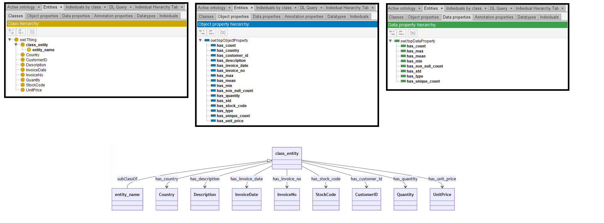
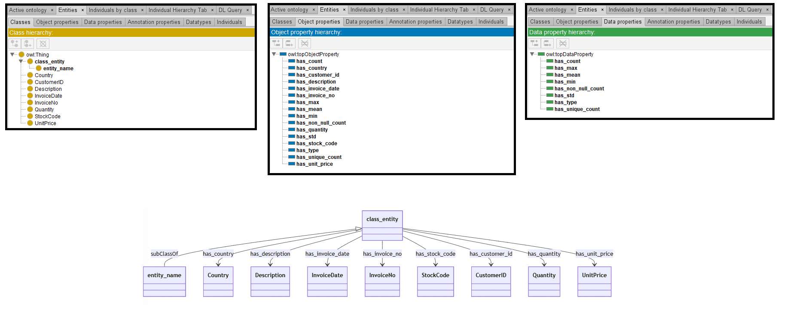

# Llama-3-8B

## Llama-3-8B-4bits

[Generated ontology](./4bits_ontology.txt)
<br>
[Corrected ontology](./4bits_ontology_corrected.txt)
<br>



### [Errors](./ontology_4bits_notes.txt)

**Incorrect serialization:**
-   Missing end dots in the prefix declarations. Example:
    ```
    @prefix owl: <http://www.w3.org/2002/07/owl#>
    @prefix xsd: <http://www.w3.org/2001/XMLSchema#>
    @prefix rdfs: <http://www.w3.org/2000/01/rdf-schema#>
    @prefix base_ontology: <http://base_ontology.com#>
    ```

-   Use of "." instead of ";" in the declaration of entity-associated statements. Example:
    ```
    <http://base_ontology.com#entity_name>
        rdfs:subClassOf <http://base_ontology.com#class_entity> .
        owl:oneOf (
            <http://base_ontology.com#Country>
            <http://base_ontology.com#Description>
            <http://base_ontology.com#InvoiceDate>
            <http://base_ontology.com#InvoiceNo>
            <http://base_ontology.com#StockCode>
            <http://base_ontology.com#CustomerID>
            <http://base_ontology.com#Quantity>
            <http://base_ontology.com#UnitPrice>
        ).
    ```


### [URIs](./4bits_ontology_URIs.xlsx)

| Prefix | URI                                           | Validity | Corrected |
|--------|-----------------------------------------------|----------|-----------|
| rdfs   | http://www.w3.org/2000/01/rdf-schema#         | X        | -         |
| owl    | http://www.w3.org/2002/07/owl#                | X        | -         |
| xsd    | http://www.w3.org/2001/XMLSchema#             | X        | -         |
|        |                                               | **3**    | **0**     |


| URI                  | Validity | Corrected            |
|----------------------|----------|----------------------|
| rdf:type (a)         | X        | -                    |
| rdfs:subClassOf      | X        | -                    |
| rdfs:domain          | X        | -                    |
| rdfs:range           | X        | -                    |
| owl:Thing            | X        | -                    |
| owl:ObjectProperty   | X        | -                    |
| xsd:double           | X        | -                    |
| xsd:string           | X        | -                    |
| *Total*              | **9**    | **0**                |


## Llama-3-8B-8bits

[Generated ontology](./8bits_ontology.txt)
<br>
[Corrected ontology](./8bits_ontology_corrected.txt)
<br>



### [Errors](./ontology_8bits_notes.txt)

**Incorrect serialization:**
-   Missing end dots in the prefix declarations. Example:
    ```
    @prefix owl: <http://www.w3.org/2002/07/owl#>
    @prefix xsd: <http://www.w3.org/2001/XMLSchema#>
    @prefix rdfs: <http://www.w3.org/2000/01/rdf-schema#>
    @prefix base_ontology: <https://base_ontology.com#>
    ```

### [URIs](./8bits_ontology_URIs.xlsx)

| Prefix | URI                                           | Validity | Corrected |
|--------|-----------------------------------------------|----------|-----------|
| rdf    | http://www.w3.org/1999/02/22-rdf-syntax-ns#   | X        | -         |
| owl    | http://www.w3.org/2002/07/owl#                | X        | -         |
| xsd    | http://www.w3.org/2001/XMLSchema#             | X        | -         |
|        |                                               | **3**    | **0**     |


| URI                  | Validity | Corrected            |
|----------------------|----------|----------------------|
| rdf:type (a)         | X        | -                    |
| rdfs:subClassOf      | X        | -                    |
| rdfs:domain          | X        | -                    |
| rdfs:range           | X        | -                    |
| owl:ObjectProperty   | X        | -                    |
| owl:Thing            | X        | -                    |
| xsd:decimal          | X        | -                    |
| xsd:string           | X        | -                    |
| *Total*              | **8**    | **0**                |


## Llama-3-8B-without quantization

[Generated ontology](./ontology.txt)


### [Errors](./ontology_notes.txt)

**Incorrect rdf/xml serialization.**