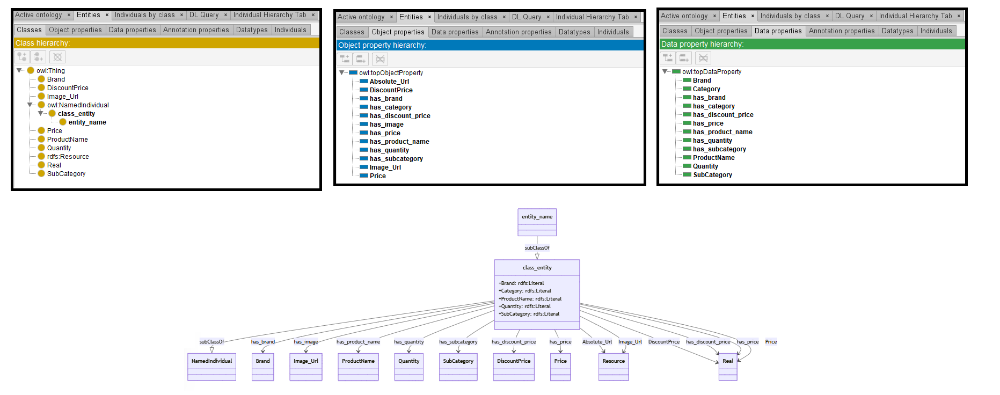

# Mistral-7B

[Generated ontology](./ontology.txt)
<br>
[Corrected ontology](./ontology_corrected.txt)
<br>



## [Errors](./ontology_notes.txt)

**Incorrect serialization:**
-   Missing end dots in the prefixes. Example:
    ```
    @prefix base: <https://base_ontology.com/>
    ```

-   Prefix ":" used, but not declarated. 

-   Incorrect sintaxis in:
    ```
    base:class_entity owl:equivalentClass [
    rdfs:subClassOf [ rdfs:Class ;
    rdfs:label "class_entity" ] ] .

    base:entity_name owl:equivalentClass [
    rdfs:subClassOf [ base:class_entity ;
    rdfs:label "entity_name" ] ] .
    ```

**Wrong URIs.** Example: rdf:Resource or rdfs:Real


## [URIs](./ontology_URIs.xlsx)

| Prefix | URI                                           | Validity | Corrected |
|--------|-----------------------------------------------|----------|-----------|
| rdf    | http://www.w3.org/1999/02/22-rdf-syntax-ns/   | -        | http://www.w3.org/1999/02/22-rdf-syntax-ns# |
| rdfs   | http://www.w3.org/2000/01/rdf-schema/         | -        | http://www.w3.org/2000/01/rdf-schema#       |
| owl    | http://www.w3.org/2002/07/owl#                | X        | -         |
|        |                                               | **1**    | **2**     |


| URI                  | Validity | Corrected            |
|----------------------|----------|----------------------|
| rdf:type (a)         | X        | -                    |
| rdf:Property         | X        | -                    |
| rdf:Resource         | -        | rdfs:Resource        |
| rdfs:label           | X        | -                    |
| rdfs:subClassOf      | X        | -                    |
| rdfs:domain          | X        | -                    |
| rdfs:range           | X        | -                    |
| rdfs:Literal         | x        | -                    |
| rdfs:Real            | -        | :Real                |
| owl:Class            | X        | -                    |
| owl:ObjectProperty   | X        | -                    |
| owl:DatatypeProperty | X        | -                    |
| *Total*              | **11**   | **2**                |

-   Use of rdf:label as dc:description or rdfs:comment