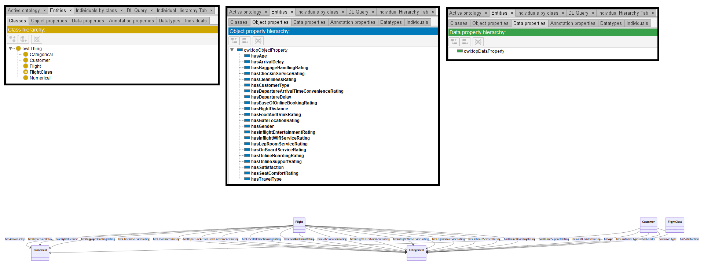

# Mixtral-8-7B

[Generated ontology](./ontology.txt)
 
[Corrected ontology](./ontology_corrected.txt)
 

## [Errors](./ontology_notes.txt)

**Uncommented text:** 
 
Here is the TURTLE syntax for the ontology based on the provided JSON data and schema description

## [URIs](./ontology_URIs.xlsx)

| Prefix | URI                                           | Validity | Corrected |
|--------|-----------------------------------------------|----------|-----------|
| rdf    | http://www.w3.org/1999/02/22-rdf-syntax-ns#   | X        | -         |
| rdfs   | http://www.w3.org/2000/01/rdf-schema#         | X        | -         |
| owl    | http://www.w3.org/2002/07/owl#                | X        | -         |
| xsd    | http://www.w3.org/2001/XMLSchema#             | X        | -         |
|        |                                               | **4**    | **0**     |

| URI                  | Validity | Corrected            |
|----------------------|----------|----------------------|
| rdf:type (a)         | X        | -                    |
| owl:Class            | X        | -                    |
| owl:unionOf          | X        | -                    |
| owl:ObjectProperty   | X        | -                    |
| rdfs:domain          | X        | -                    |
| rdfs:range           | X        | -                    |
| *Total*              | **6**    | **0**                |