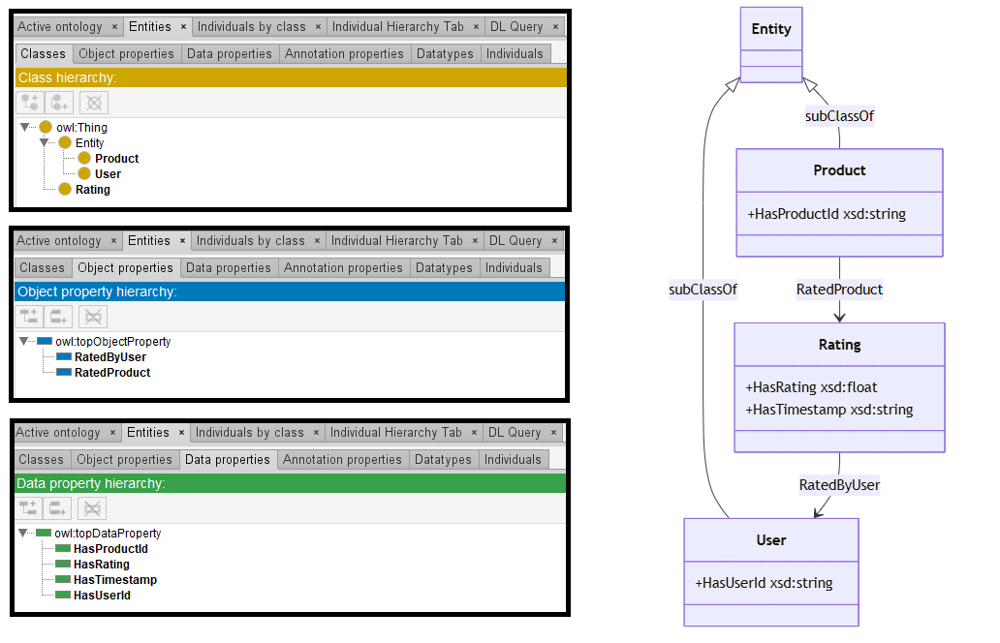

# Mixtral-8-7B

[Generated ontology](./ontology.txt)
<br>
[Corrected ontology](./ontology_corrected.txt)
<br>



## [Errors](./ontology_notes.txt)

**Incorrect serialization:**
-   Incorrect restriction declaration:
    ```
    base:Rating rdf:type owl:Class ;
        rdfs:subClassOf owl:Thing ;
        owl:onClass [
            owl:intersectionOf (
                [ rdf:type owl:Restriction ;
                    owl:onProperty base:RatedProduct ;
                    owl:someValuesFrom base:Product ] ,
                [ rdf:type owl:Restriction ;
                    owl:onProperty base:RatedByUser ;
                    owl:someValuesFrom base:User ]
            )
        ] .
    ```

## [URIs](./ontology_URIs.xlsx)

| Prefix | URI                                           | Validity | Corrected |
|--------|-----------------------------------------------|----------|-----------|
| rdf    | http://www.w3.org/1999/02/22-rdf-syntax-ns#   | X        | -         |
| rdfs   | http://www.w3.org/2000/01/rdf-schema#         | X        | -         |
| owl    | http://www.w3.org/2002/07/owl#                | X        | -         |
| xsd    | http://www.w3.org/2001/XMLSchema#             | X        | -         |
|        |                                               | **4**    | **0**     |


| URI                  | Validity | Corrected            |
|----------------------|----------|----------------------|
| rdf:type (a)         | X        | -                    |
| owl:Ontology         | X        | -                    |
| owl:Class            | X        | -                    |
| rdfs:subClassOf      | X        | -                    |
| owl:Thing            | X        | -                    |
| owl:onClass          | X        | -                    |
| owl:intersectionOf   | X        | -                    |
| owl:Restriction      | X        | -                    |
| owl:onProperty       | X        | -                    |
| owl:someValuesFrom   | X        | -                    |
| owl:ObjectProperty   | X        | -                    |
| owl:DatatypeProperty | X        | -                    |
| rdfs:domain          | X        | -                    |
| rdfs:range           | X        | -                    |
| xsd:string           | X        | -                    |
| xsd:float            | X        | -                    |
| *Total*              | **16**   | **0**                |

-   owl:onClass used incorrectly (only used within cardinality restrictions).
-   intersectionOf also used incorrectly.