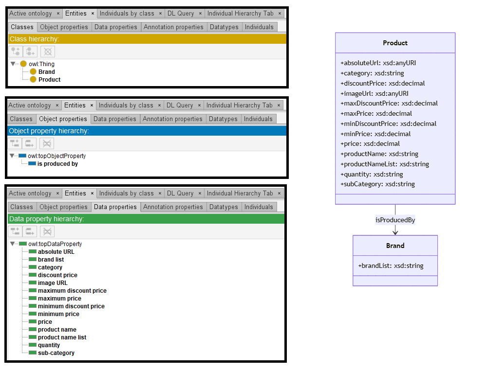

# GPT-3.5

[Generated ontology](./ontology.owl)
 
[Corrected ontology](./ontology_corrected.owl)
 

## [Errors](./ontology_notes.txt)

**Incorrect serialization**: 
-   Prefix 'owl' used but not defined.
-   Prefix 'um' used but not defined.

## [URIs](./ontology_URIs.xlsx)

| Prefix | URI                                           | Validity | Corrected |
|--------|-----------------------------------------------|----------|-----------|
| rdf    | http://www.w3.org/1999/02/22-rdf-syntax-ns#   | X        | -         |
| rdfs   | http://www.w3.org/2000/01/rdf-schema#         | X        | -         |
| xsd    | http://www.w3.org/2001/XMLSchema#             | X        | -         |
|        |                                               | **3**    | **0**     |

| URI                  | Validity | Corrected            |
|----------------------|----------|----------------------|
| owl:Ontology         | X        | -                    |
| rdf:type (a)         | X        | -                    |
| owl:Class            | X        | -                    |
| rdfs:label           | X        | -                    |
| rdfs:comment         | X        | -                    |
| owl:DatatypeProperty | X        | -                    |
| owl:ObjectProperty   | X        | -                    |
| rdfs:domain          | X        | -                    |
| rdfs:range           | X        | -                    |
| xsd:string           | X        | -                    |
| xsd:decimal          | X        | -                    |
| xsd:anyURI           | X        | -                    |
| *Total*              | **12**   | **0**                |