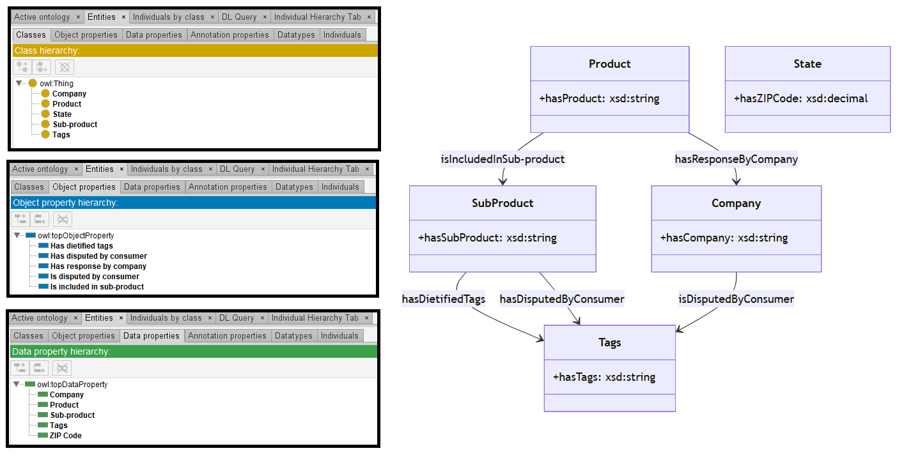
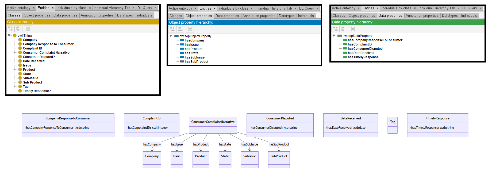
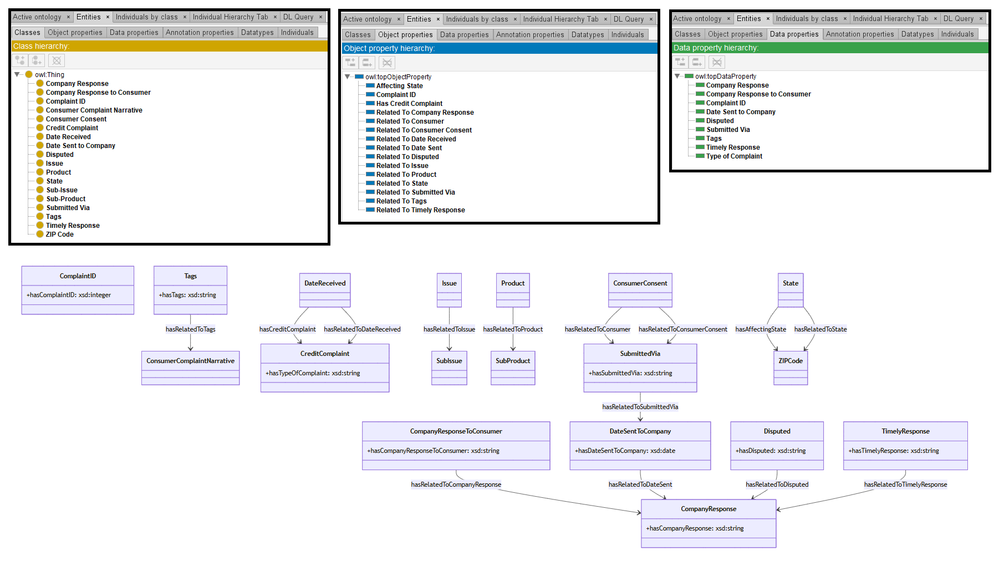

# Llama-3-8B

## Llama-3-8B-4bits

[Generated ontology](./ontology_4bits.txt)
<br>



## [Errors](./ontology_4bits_notes.txt)

Ontology without syntax errors.


## [URIs](./ontology_4bits_URIs.xlsx)

| Prefix | URI                                           | Validity | Corrected |
|--------|-----------------------------------------------|----------|-----------|
| rdf    | http://www.w3.org/1999/02/22-rdf-syntax-ns#   | X        | -         |
| rdfs   | http://www.w3.org/2000/01/rdf-schema#         | X        | -         |
| owl    | http://www.w3.org/2002/07/owl#                | X        | -         |
| xsd    | http://www.w3.org/2001/XMLSchema#             | X        | -         |
|        |                                               | **4**    | **0**     |

| URI                  | Validity | Corrected            |
|----------------------|----------|----------------------|
| owl:Ontology         | X        | -                    |
| rdf:type (a)         | X        | -                    |
| owl:Class            | X        | -                    |
| rdfs:label           | X        | -                    |
| owl:DatatypeProperty | X        | -                    |
| owl:ObjectProperty   | X        | -                    |
| rdfs:domain          | X        | -                    |
| rdfs:range           | X        | -                    |
| xsd:string           | X        | -                    |
| xsd:decimal          | X        | -                    |
| *Total*              | **10**   | **0**                |


## Llama-3-8B-8bits

[Generated ontology](./ontology_8bits.txt)
<br>



## [Errors](./ontology_8bits_notes.txt)

Ontology without syntax errors.


## [URIs](./ontology_8bits_URIs.xlsx)

| Prefix | URI                                           | Validity | Corrected |
|--------|-----------------------------------------------|----------|-----------|
| rdf    | http://www.w3.org/1999/02/22-rdf-syntax-ns#   | X        | -         |
| rdfs   | http://www.w3.org/2000/01/rdf-schema#         | X        | -         |
| owl    | http://www.w3.org/2002/07/owl#                | X        | -         |
| xsd    | http://www.w3.org/2001/XMLSchema#             | X        | -         |
|        |                                               | **4**    | **0**     |

| URI                  | Validity | Corrected            |
|----------------------|----------|----------------------|
| rdf:type (a)         | X        | -                    |
| owl:Class            | X        | -                    |
| rdfs:label           | X        | -                    |
| owl:DatatypeProperty | X        | -                    |
| owl:ObjectProperty   | X        | -                    |
| rdfs:domain          | X        | -                    |
| rdfs:range           | X        | -                    |
| xsd:string           | X        | -                    |
| xsd:date             | X        | -                    |
| xsd:integer          | X        | -                    |
| *Total*              | **10**   | **0**                |


## Llama-3-8B-all

[Generated ontology](./ontology_all.txt)
<br>



## [Errors](./ontology_all_notes.txt)

Ontology without syntax errors, but semantic errors:
-   Datatype property as Object property:
    ```
    um:hasComplaintID a owl:ObjectProperty ;
        rdfs:domain um:ComplaintID ;
        rdfs:range xsd:string ;
        rdfs:label "Has Complaint ID".
    ```


## [URIs](./ontology_all_URIs.xlsx)

| Prefix | URI                                           | Validity | Corrected |
|--------|-----------------------------------------------|----------|-----------|
| rdf    | http://www.w3.org/1999/02/22-rdf-syntax-ns#   | X        | -         |
| rdfs   | http://www.w3.org/2000/01/rdf-schema#         | X        | -         |
| owl    | http://www.w3.org/2002/07/owl#                | X        | -         |
| xsd    | http://www.w3.org/2001/XMLSchema#             | X        | -         |
|        |                                               | **4**    | **0**     |

| URI                  | Validity | Corrected            |
|----------------------|----------|----------------------|
| owl:Ontology         | X        | -                    |
| rdf:type (a)         | X        | -                    |
| owl:Class            | X        | -                    |
| rdfs:label           | X        | -                    |
| owl:DatatypeProperty | X        | -                    |
| owl:ObjectProperty   | X        | -                    |
| rdfs:domain          | X        | -                    |
| rdfs:range           | X        | -                    |
| xsd:string           | X        | -                    |
| xsd:date             | X        | -                    |
| xsd:integer          | X        | -                    |
| *Total*              | **11**   | **0**                |