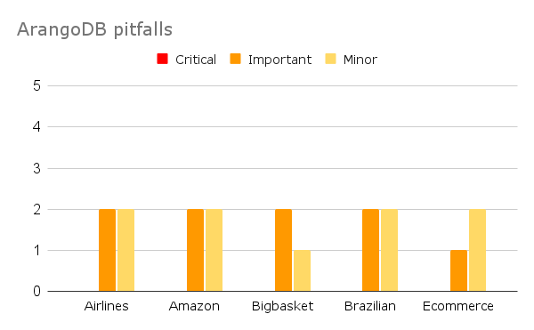
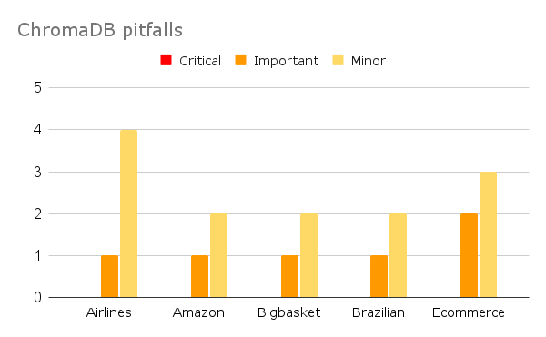

# Comparison of external databases - Ontology building
## The external databases
1. **Arango.** Allows the semantic and structural similarity search, weighing 0.7 for semantic similarity and 0.3 for structural similarity.
2. **Chroma.** Allows vector similarity search.

In both databases, 39 ontologies related to E-Commerce are stored.
## Evaluation of the performance 
The performance of each approach will be evaluated using [**OOPS! tool**](https://oops.linkeddata.es/catalogue.jsp)
for ontology assessment. The objective is to identify potential issues that may result in modeling errors in each of the 
ontologies built by the LLM using these external databases.
### Summary table - general performance 
This table shows the pitfalls (common errors) for each approach in the construction of 5 different ontologies from 5 different CSV files related to E-Commerce.
| Pitfall  | Arango  | Chroma  |
|------------|------------|------------|
| Critical | 0 | 0 |
| Important | 9 | 6 |
| Minor | 9 | 13 |

Arango has 3 more Important pitfalls but 4 less Minor pitfalls compared to Chroma.
### Pitfalls by CSV test file

* Arango has 2 Important pitfalls in all CSV test files, except for the E-Commerce file.
* Chroma has only 2 Important pitfalls in the E-commerce file.
* Chroma increases its Minor pitfalls to 4 in the Airlines file.

### Descriptions of the pitfalls found
**(I) P10. Missing disjointness.** The ontology lacks disjoint axioms between classes or between properties that should be defined as disjoint.

**(I) P38. No OWL ontology declaration.** This pitfall consists in not declaring the owl:Ontology tag, which provides the ontology metadata.

**(M) P07. Merging different concepts in the same class.** Refers to the creation of a single class whose name ambiguously or incorrectly encompasses two or more distinct and unrelated concepts. 
  * (Creating a class named Vehicle that simultaneously represents both land vehicles (e.g., cars, bicycles) and watercraft (e.g., boats, submarines) without distinguishing between these distinct categories.)

**(M) P08. Missing annotations.** Annotations are metadata elements attached to ontology components to provide additional information that is primarily intended for human understanding (e.g., rdfs:label, skos:prefLabel, lemon:LexicalEntry, skos:altLabel,  rdfs:comment, dc:description).

**(M) P13. Inverse relationships not explicitly declared.** This pitfall occurs when properties in an ontology lack explicitly defined inverse properties using owl:inverseOf, except for those properties that are inherently symmetric (owl:SymmetricProperty). Without these inverse declarations, the ontology misses out on bidirectional inferencing capabilities, which can lead to incomplete reasoning and potential inconsistencies.

**(M) P22. Using different naming conventions in the ontology.** The ontology elements are not named following the same convention (for example CamelCase or use of delimiters as "-" or "_").

